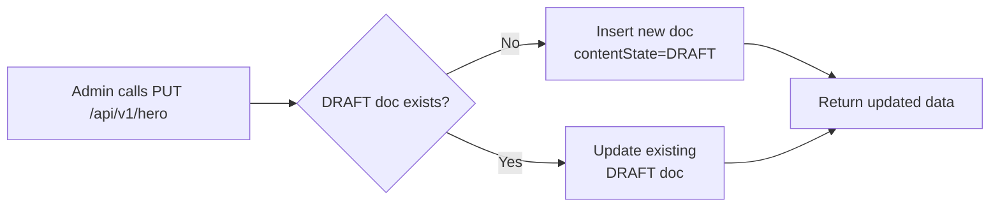
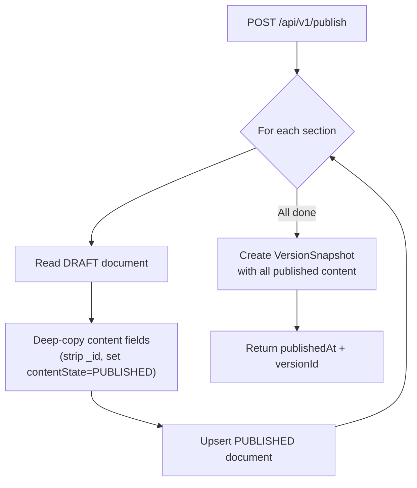

# Database Design — Complete MongoDB Schema Reference

> **Database:** MongoDB 7.x  
> **ODM:** Spring Data MongoDB  
> **Database name:** `tobyresume`

---

## 1. Design Principles

| Principle | Decision |
|-----------|----------|
| **Draft/Published separation** | Each content collection stores exactly **2 documents** — one `DRAFT`, one `PUBLISHED`. Unique index enforces this. |
| **Embedded items** | List-based sections (experiences, projects, etc.) embed items as arrays inside the parent document. Resume lists are small (<20 items); this avoids joins and simplifies publish (deep copy). |
| **i18n via locale-keyed maps** | Localizable fields use `Map<String, T>` keyed by `"en"` / `"vi"`. Only these two locales are valid. |
| **UUID for embedded item IDs** | Embedded items use server-generated UUID strings, not MongoDB ObjectIds. |
| **Full snapshots for versions** | Each publish creates a complete snapshot of all sections — simple rollback, negligible storage for single-user. |

---

## 2. Collections Overview

| # | Collection Name | Type | Documents | Purpose |
|---|----------------|------|-----------|---------|
| 1 | `hero` | Content (singleton) | 2 (DRAFT + PUBLISHED) | Hero / About Me section |
| 2 | `work_experiences` | Content (list container) | 2 | Work Experience items |
| 3 | `projects` | Content (list container) | 2 | Projects / Portfolio items |
| 4 | `education` | Content (list container) | 2 | Education items |
| 5 | `skills` | Content (list container) | 2 | Skill categories + items |
| 6 | `certifications` | Content (list container) | 2 | Certifications & Awards items |
| 7 | `social_links` | Content (list container) | 2 | Social link items |
| 8 | `site_settings` | Configuration | 1 | Global site settings |
| 9 | `version_snapshots` | History | Unbounded (1 per publish) | Full site snapshots |

---

## 3. Field-Level Localization Matrix

**Authoritative reference** for which fields are localized `Map<String, T>` vs plain values.

| Section | Localized Fields (`Map<String, T>`) | Plain Fields |
|---------|-------------------------------------|-------------|
| **Hero** | `tagline` `bio` `fullName` `title` — all `Map<String, String>` | `profilePhotoMediaId` (String) |
| **Work Experience** | `company` `role` — `Map<String, String>` ; `bulletPoints` — `Map<String, List<String>>` | `startDate` `endDate` (String) `techUsed` (String[]) `order` (int) |
| **Projects** | `title` — `Map<String, String>` ; `description` — `Map<String, String>` (Markdown) | `techStack` (String[]) `links` (Link[]) `mediaIds` (String[]) `visible` (boolean) `order` (int) |
| **Education** | `details` — `Map<String, String>` | `institution` `degree` `field` (String) `startDate` `endDate` (String) `order` (int) |
| **Skills** | Category `name` — `Map<String, String>` | Item `name` (String) Item `level` (String, optional) |
| **Certifications** | `description` — `Map<String, String>` (optional) | `title` `issuer` (String) `date` (String) `url` (String, optional) `order` (int) |
| **Social Links** | _None_ | `platform` `url` `icon` (String) `order` (int) |

---

## 4. Shared Types

### 4.1 ContentState (Enum)

```java
public enum ContentState {
    DRAFT,
    PUBLISHED
}
```

Stored as a string in MongoDB: `"DRAFT"` or `"PUBLISHED"`.

### 4.2 BaseDocument (Abstract)

All content collections and site_settings extend this:

| Field | Type | Description |
|-------|------|-------------|
| `_id` | `ObjectId` | MongoDB auto-generated |
| `createdAt` | `DateTime` | Set on first insert (Spring Data auditing `@CreatedDate`) |
| `updatedAt` | `DateTime` | Updated on every save (`@LastModifiedDate`) |

### 4.3 Link (Embedded)

Used in Projects:

| Field | Type | Required | Validation |
|-------|------|----------|------------|
| `label` | `String` | Yes | Max 100 chars |
| `url` | `String` | Yes | Valid URL format |

---

## 5. Collection Schemas

### 5.1 `hero` — Hero / About Me

**Type:** Singleton per state (max 2 documents)

| Field | Type | Localized | Required | Validation |
|-------|------|-----------|----------|------------|
| `_id` | `ObjectId` | — | Auto | — |
| `contentState` | `String` | — | Yes | `"DRAFT"` or `"PUBLISHED"` |
| `tagline` | `Map<String, String>` | Yes | No | Max 500 chars per locale |
| `bio` | `Map<String, String>` | Yes | No | Max 2000 chars per locale, Markdown/HTML |
| `fullName` | `Map<String, String>` | Yes | No | Max 200 chars per locale |
| `title` | `Map<String, String>` | Yes | No | Max 200 chars per locale |
| `profilePhotoMediaId` | `String` | No | No | Reference to media entity (Phase 2); nullable |
| `createdAt` | `DateTime` | — | Auto | — |
| `updatedAt` | `DateTime` | — | Auto | — |

**Example document:**

```json
{
  "_id": ObjectId("..."),
  "contentState": "DRAFT",
  "tagline": {
    "en": "Full Stack Developer & Problem Solver",
    "vi": "Lập trình viên Full Stack & Giải quyết vấn đề"
  },
  "bio": {
    "en": "I build scalable backend systems with **Java** and **Spring Boot**...",
    "vi": "Tôi xây dựng hệ thống backend có khả năng mở rộng với **Java** và **Spring Boot**..."
  },
  "fullName": {
    "en": "Toby Nguyen",
    "vi": "Nguyễn Toby"
  },
  "title": {
    "en": "Software Engineer",
    "vi": "Kỹ sư phần mềm"
  },
  "profilePhotoMediaId": null,
  "createdAt": ISODate("2026-02-11T10:00:00Z"),
  "updatedAt": ISODate("2026-02-11T10:30:00Z")
}
```

**Spring Data mapping:**

```java
@Document(collection = "hero")
public class Hero extends BaseDocument {
    @Indexed(unique = true)
    private ContentState contentState;

    @ValidLocaleKeys
    private Map<String, String> tagline;

    @ValidLocaleKeys
    private Map<String, String> bio;

    @ValidLocaleKeys
    private Map<String, String> fullName;

    @ValidLocaleKeys
    private Map<String, String> title;

    private String profilePhotoMediaId;
}
```

---

### 5.2 `work_experiences` — Work Experience

**Type:** List container per state (max 2 documents; items embedded as array)

#### Container Document

| Field | Type | Required | Validation |
|-------|------|----------|------------|
| `_id` | `ObjectId` | Auto | — |
| `contentState` | `String` | Yes | `"DRAFT"` or `"PUBLISHED"` |
| `items` | `ExperienceItem[]` | Yes | Embedded array; empty array is valid |
| `createdAt` | `DateTime` | Auto | — |
| `updatedAt` | `DateTime` | Auto | — |

#### ExperienceItem (Embedded)

| Field | Type | Localized | Required | Validation |
|-------|------|-----------|----------|------------|
| `itemId` | `String` | — | Yes | UUID, server-generated |
| `company` | `Map<String, String>` | Yes | Yes (at least one locale) | Max 200 chars per locale |
| `role` | `Map<String, String>` | Yes | Yes (at least one locale) | Max 200 chars per locale |
| `startDate` | `String` | No | Yes | Format: `YYYY-MM` |
| `endDate` | `String` | No | No | Format: `YYYY-MM` or `null` (means "Present") |
| `bulletPoints` | `Map<String, List<String>>` | Yes | No | Max 10 items per locale; each max 500 chars |
| `techUsed` | `String[]` | No | No | Array of technology names |
| `order` | `int` | No | Yes | Sort position, 0-based |

**Example document:**

```json
{
  "_id": ObjectId("..."),
  "contentState": "DRAFT",
  "items": [
    {
      "itemId": "a1b2c3d4-e5f6-7890-abcd-ef1234567890",
      "company": { "en": "TechCorp", "vi": "TechCorp" },
      "role": { "en": "Senior Backend Engineer", "vi": "Kỹ sư Backend cao cấp" },
      "startDate": "2023-01",
      "endDate": null,
      "bulletPoints": {
        "en": [
          "Led a team of 5 engineers building microservices architecture",
          "Reduced API latency by 40% through caching optimization"
        ],
        "vi": [
          "Dẫn dắt đội 5 kỹ sư xây dựng kiến trúc microservices",
          "Giảm 40% độ trễ API thông qua tối ưu hóa bộ nhớ đệm"
        ]
      },
      "techUsed": ["Java", "Spring Boot", "MongoDB", "Redis"],
      "order": 0
    },
    {
      "itemId": "b2c3d4e5-f6a7-8901-bcde-f12345678901",
      "company": { "en": "StartupXYZ" },
      "role": { "en": "Software Developer" },
      "startDate": "2020-06",
      "endDate": "2022-12",
      "bulletPoints": {
        "en": ["Built REST APIs for e-commerce platform"]
      },
      "techUsed": ["Node.js", "PostgreSQL"],
      "order": 1
    }
  ],
  "createdAt": ISODate("2026-02-11T10:00:00Z"),
  "updatedAt": ISODate("2026-02-11T11:15:00Z")
}
```

**Spring Data mapping:**

```java
@Document(collection = "work_experiences")
public class WorkExperience extends BaseDocument {
    @Indexed(unique = true)
    private ContentState contentState;
    private List<ExperienceItem> items = new ArrayList<>();
}

public class ExperienceItem {
    private String itemId;
    private Map<String, String> company;
    private Map<String, String> role;
    private String startDate;
    private String endDate;
    private Map<String, List<String>> bulletPoints;
    private List<String> techUsed;
    private int order;
}
```

---

### 5.3 `projects` — Projects / Portfolio

**Type:** List container (same pattern as work_experiences)

#### ProjectItem (Embedded)

| Field | Type | Localized | Required | Validation |
|-------|------|-----------|----------|------------|
| `itemId` | `String` | — | Yes | UUID |
| `title` | `Map<String, String>` | Yes | Yes | Max 200 chars per locale |
| `description` | `Map<String, String>` | Yes | No | Max 3000 chars per locale, Markdown |
| `techStack` | `String[]` | No | No | Array of technology names |
| `links` | `Link[]` | No | No | Max 10 links; each: `{ label, url }` |
| `mediaIds` | `String[]` | No | No | Max 10; references to media (Phase 2) |
| `visible` | `boolean` | No | Yes | Default `true`; `false` hides from public API |
| `order` | `int` | No | Yes | Sort position |

**Example document:**

```json
{
  "_id": ObjectId("..."),
  "contentState": "DRAFT",
  "items": [
    {
      "itemId": "prj-uuid-001",
      "title": {
        "en": "Toby.Résumé",
        "vi": "Toby.Résumé"
      },
      "description": {
        "en": "A personal portfolio CMS with AI-powered resume tailoring...",
        "vi": "Hệ thống quản lý hồ sơ cá nhân với AI tối ưu hóa CV..."
      },
      "techStack": ["Java", "Spring Boot", "MongoDB", "GraphQL"],
      "links": [
        { "label": "GitHub", "url": "https://github.com/toby/resume" },
        { "label": "Live Demo", "url": "https://toby.dev" }
      ],
      "mediaIds": [],
      "visible": true,
      "order": 0
    }
  ],
  "createdAt": ISODate("2026-02-11T10:00:00Z"),
  "updatedAt": ISODate("2026-02-11T10:00:00Z")
}
```

---

### 5.4 `education` — Education

#### EducationItem (Embedded)

| Field | Type | Localized | Required | Validation |
|-------|------|-----------|----------|------------|
| `itemId` | `String` | — | Yes | UUID |
| `institution` | `String` | **No** | Yes | Max 200 chars |
| `degree` | `String` | **No** | Yes | Max 200 chars |
| `field` | `String` | **No** | No | Max 200 chars |
| `startDate` | `String` | No | Yes | `YYYY-MM` |
| `endDate` | `String` | No | No | `YYYY-MM` or `null` |
| `details` | `Map<String, String>` | **Yes** | No | Max 1000 chars per locale |
| `order` | `int` | No | Yes | Sort position |

**Example document:**

```json
{
  "_id": ObjectId("..."),
  "contentState": "DRAFT",
  "items": [
    {
      "itemId": "edu-uuid-001",
      "institution": "University of Technology",
      "degree": "Bachelor of Science",
      "field": "Computer Science",
      "startDate": "2016-09",
      "endDate": "2020-06",
      "details": {
        "en": "Graduated with honors. Focus on distributed systems.",
        "vi": "Tốt nghiệp loại giỏi. Chuyên ngành hệ thống phân tán."
      },
      "order": 0
    }
  ],
  "createdAt": ISODate("2026-02-11T10:00:00Z"),
  "updatedAt": ISODate("2026-02-11T10:00:00Z")
}
```

> **Note:** `institution`, `degree`, `field` are **plain strings** (not localized). Only `details` is localized per requirements.

---

### 5.5 `skills` — Skills / Tech Stack

#### SkillCategory (Embedded)

| Field | Type | Localized | Required | Validation |
|-------|------|-----------|----------|------------|
| `categoryId` | `String` | — | Yes | UUID |
| `name` | `Map<String, String>` | **Yes** | Yes | Max 100 chars per locale |
| `items` | `SkillItem[]` | — | Yes | Max 50 items per category |
| `order` | `int` | No | Yes | Sort position |

#### SkillItem (Nested in SkillCategory)

| Field | Type | Localized | Required | Validation |
|-------|------|-----------|----------|------------|
| `name` | `String` | **No** | Yes | Max 100 chars |
| `level` | `String` | **No** | No | Optional (e.g. "Expert", "Intermediate") |

**Example document:**

```json
{
  "_id": ObjectId("..."),
  "contentState": "DRAFT",
  "categories": [
    {
      "categoryId": "skill-cat-001",
      "name": { "en": "Programming Languages", "vi": "Ngôn ngữ lập trình" },
      "items": [
        { "name": "Java", "level": "Expert" },
        { "name": "TypeScript", "level": "Advanced" },
        { "name": "Python", "level": "Intermediate" }
      ],
      "order": 0
    },
    {
      "categoryId": "skill-cat-002",
      "name": { "en": "Frameworks", "vi": "Framework" },
      "items": [
        { "name": "Spring Boot", "level": "Expert" },
        { "name": "React", "level": "Advanced" }
      ],
      "order": 1
    }
  ],
  "createdAt": ISODate("2026-02-11T10:00:00Z"),
  "updatedAt": ISODate("2026-02-11T10:00:00Z")
}
```

> **Note:** Skill item `name` and `level` are **plain strings** (not localized). Only category `name` is localized.

---

### 5.6 `certifications` — Certifications & Awards

#### CertificationItem (Embedded)

| Field | Type | Localized | Required | Validation |
|-------|------|-----------|----------|------------|
| `itemId` | `String` | — | Yes | UUID |
| `title` | `String` | **No** | Yes | Max 200 chars |
| `issuer` | `String` | **No** | Yes | Max 200 chars |
| `date` | `String` | No | No | `YYYY-MM` or `YYYY-MM-DD` |
| `url` | `String` | No | No | Valid URL, optional |
| `description` | `Map<String, String>` | **Yes** | No | Max 500 chars per locale, optional |
| `order` | `int` | No | Yes | Sort position |

**Example document:**

```json
{
  "_id": ObjectId("..."),
  "contentState": "DRAFT",
  "items": [
    {
      "itemId": "cert-uuid-001",
      "title": "AWS Solutions Architect Associate",
      "issuer": "Amazon Web Services",
      "date": "2025-03",
      "url": "https://aws.amazon.com/verify/cert-123",
      "description": {
        "en": "Cloud architecture design and implementation certification.",
        "vi": "Chứng chỉ thiết kế và triển khai kiến trúc đám mây."
      },
      "order": 0
    }
  ],
  "createdAt": ISODate("2026-02-11T10:00:00Z"),
  "updatedAt": ISODate("2026-02-11T10:00:00Z")
}
```

> **Note:** `title` and `issuer` are **plain strings** (not localized). Only `description` is localized.

---

### 5.7 `social_links` — Social Links

#### SocialLinkItem (Embedded)

| Field | Type | Localized | Required | Validation |
|-------|------|-----------|----------|------------|
| `itemId` | `String` | — | Yes | UUID |
| `platform` | `String` | **No** | Yes | Max 50 chars (e.g. "GitHub", "LinkedIn") |
| `url` | `String` | **No** | Yes | Valid URL |
| `icon` | `String` | **No** | No | Icon identifier or URL, optional |
| `order` | `int` | No | Yes | Sort position |

**Example document:**

```json
{
  "_id": ObjectId("..."),
  "contentState": "DRAFT",
  "items": [
    { "itemId": "sl-uuid-001", "platform": "GitHub", "url": "https://github.com/toby", "icon": "github", "order": 0 },
    { "itemId": "sl-uuid-002", "platform": "LinkedIn", "url": "https://linkedin.com/in/toby", "icon": "linkedin", "order": 1 },
    { "itemId": "sl-uuid-003", "platform": "Email", "url": "mailto:toby@example.com", "icon": "mail", "order": 2 }
  ],
  "createdAt": ISODate("2026-02-11T10:00:00Z"),
  "updatedAt": ISODate("2026-02-11T10:00:00Z")
}
```

> **Note:** Social Links have **no localized fields**.

---

### 5.8 `site_settings` — Global Configuration

**Type:** Singleton (exactly 1 document)

| Field | Type | Required | Validation |
|-------|------|----------|------------|
| `_id` | `ObjectId` | Auto | — |
| `supportedLocales` | `String[]` | Yes | Fixed: `["en", "vi"]` |
| `defaultLocale` | `String` | Yes | Must be one of `supportedLocales` |
| `pdfSectionVisibility` | `Map<String, Boolean>` | Yes | Keys: `hero`, `experiences`, `projects`, `education`, `skills`, `certifications`, `socialLinks` |
| `createdAt` | `DateTime` | Auto | — |
| `updatedAt` | `DateTime` | Auto | — |

**Example document:**

```json
{
  "_id": ObjectId("..."),
  "supportedLocales": ["en", "vi"],
  "defaultLocale": "en",
  "pdfSectionVisibility": {
    "hero": true,
    "experiences": true,
    "projects": true,
    "education": true,
    "skills": true,
    "certifications": true,
    "socialLinks": false
  },
  "createdAt": ISODate("2026-02-11T10:00:00Z"),
  "updatedAt": ISODate("2026-02-11T10:00:00Z")
}
```

**Bootstrap:** If no `site_settings` document exists on first startup, the application inserts one with the defaults shown above.

---

### 5.9 `version_snapshots` — Publish History

**Type:** Append-only (1 document created per publish)

| Field | Type | Required | Description |
|-------|------|----------|-------------|
| `_id` | `ObjectId` | Auto | — |
| `content` | `Object` | Yes | Full snapshot of all sections at publish time |
| `content.hero` | `Object` | Yes | Complete hero document (without `_id`, `contentState`) |
| `content.experiences` | `Object` | Yes | Complete experiences document |
| `content.projects` | `Object` | Yes | Complete projects document |
| `content.education` | `Object` | Yes | Complete education document |
| `content.skills` | `Object` | Yes | Complete skills document |
| `content.certifications` | `Object` | Yes | Complete certifications document |
| `content.socialLinks` | `Object` | Yes | Complete social links document |
| `label` | `String` | No | Optional human-readable label |
| `publishedAt` | `DateTime` | Yes | Timestamp of publish action |

**Example document:**

```json
{
  "_id": ObjectId("..."),
  "content": {
    "hero": {
      "tagline": { "en": "Full Stack Developer", "vi": "Lập trình viên Full Stack" },
      "bio": { "en": "...", "vi": "..." },
      "fullName": { "en": "Toby Nguyen", "vi": "Nguyễn Toby" },
      "title": { "en": "Software Engineer", "vi": "Kỹ sư phần mềm" },
      "profilePhotoMediaId": null
    },
    "experiences": {
      "items": [ { "itemId": "...", "company": { "en": "..." }, "..." : "..." } ]
    },
    "projects": { "items": [] },
    "education": { "items": [] },
    "skills": { "categories": [] },
    "certifications": { "items": [] },
    "socialLinks": { "items": [] }
  },
  "label": null,
  "publishedAt": ISODate("2026-02-11T12:00:00Z")
}
```

> **Phase 1 scope:** Snapshots are created (write-only) on each publish. Rollback and listing endpoints are Phase 3.

---

## 6. Entity Relationship Diagram

```mermaid
erDiagram
    HERO {
        ObjectId _id PK
        String contentState UK "DRAFT | PUBLISHED"
        Map tagline "{ en, vi }"
        Map bio "{ en, vi }"
        Map fullName "{ en, vi }"
        Map title "{ en, vi }"
        String profilePhotoMediaId "nullable"
        DateTime createdAt
        DateTime updatedAt
    }

    WORK_EXPERIENCES {
        ObjectId _id PK
        String contentState UK "DRAFT | PUBLISHED"
        DateTime createdAt
        DateTime updatedAt
    }

    EXPERIENCE_ITEM {
        String itemId "UUID"
        Map company "localized"
        Map role "localized"
        String startDate "YYYY-MM"
        String endDate "nullable"
        Map bulletPoints "localized list"
        StringArray techUsed
        int order
    }

    PROJECTS {
        ObjectId _id PK
        String contentState UK
        DateTime createdAt
        DateTime updatedAt
    }

    PROJECT_ITEM {
        String itemId "UUID"
        Map title "localized"
        Map description "localized Markdown"
        StringArray techStack
        LinkArray links
        StringArray mediaIds "Phase 2"
        boolean visible "default true"
        int order
    }

    EDUCATION {
        ObjectId _id PK
        String contentState UK
        DateTime createdAt
        DateTime updatedAt
    }

    EDUCATION_ITEM {
        String itemId "UUID"
        String institution "plain"
        String degree "plain"
        String field "plain"
        String startDate "YYYY-MM"
        String endDate "nullable"
        Map details "localized"
        int order
    }

    SKILLS {
        ObjectId _id PK
        String contentState UK
        DateTime createdAt
        DateTime updatedAt
    }

    SKILL_CATEGORY {
        String categoryId "UUID"
        Map name "localized"
        int order
    }

    SKILL_ITEM {
        String name "plain"
        String level "optional"
    }

    CERTIFICATIONS {
        ObjectId _id PK
        String contentState UK
        DateTime createdAt
        DateTime updatedAt
    }

    CERTIFICATION_ITEM {
        String itemId "UUID"
        String title "plain"
        String issuer "plain"
        String date "YYYY-MM"
        String url "optional"
        Map description "localized optional"
        int order
    }

    SOCIAL_LINKS {
        ObjectId _id PK
        String contentState UK
        DateTime createdAt
        DateTime updatedAt
    }

    SOCIAL_LINK_ITEM {
        String itemId "UUID"
        String platform "plain"
        String url "plain"
        String icon "optional"
        int order
    }

    SITE_SETTINGS {
        ObjectId _id PK
        StringArray supportedLocales
        String defaultLocale
        Map pdfSectionVisibility
        DateTime createdAt
        DateTime updatedAt
    }

    VERSION_SNAPSHOTS {
        ObjectId _id PK
        Object content "full snapshot"
        String label "optional"
        DateTime publishedAt
    }

    WORK_EXPERIENCES ||--o{ EXPERIENCE_ITEM : "embeds"
    PROJECTS ||--o{ PROJECT_ITEM : "embeds"
    EDUCATION ||--o{ EDUCATION_ITEM : "embeds"
    SKILLS ||--o{ SKILL_CATEGORY : "embeds"
    SKILL_CATEGORY ||--o{ SKILL_ITEM : "embeds"
    CERTIFICATIONS ||--o{ CERTIFICATION_ITEM : "embeds"
    SOCIAL_LINKS ||--o{ SOCIAL_LINK_ITEM : "embeds"
```



---

## 7. Indexes

| Collection | Index | Unique | Purpose |
|-----------|-------|--------|---------|
| `hero` | `{ contentState: 1 }` | Yes | Max 1 DRAFT + 1 PUBLISHED |
| `work_experiences` | `{ contentState: 1 }` | Yes | Same |
| `projects` | `{ contentState: 1 }` | Yes | Same |
| `education` | `{ contentState: 1 }` | Yes | Same |
| `skills` | `{ contentState: 1 }` | Yes | Same |
| `certifications` | `{ contentState: 1 }` | Yes | Same |
| `social_links` | `{ contentState: 1 }` | Yes | Same |
| `version_snapshots` | `{ publishedAt: -1 }` | No | Query latest snapshots first |

> **Note:** Spring Data auto-creates `_id` index. The `contentState` unique index is the primary query path for all read operations (`findByContentState`).

---

## 8. Data Lifecycle

### 8.1 Document Creation



- Content documents are created lazily on first admin write (no seed data required)
- `site_settings` is bootstrapped with defaults on first startup if absent
- `version_snapshots` are created only during publish

### 8.2 Publish Pipeline



### 8.3 Query Patterns

| Operation | Collection | Query | Notes |
|-----------|-----------|-------|-------|
| Admin GET (draft) | Any content | `{ contentState: "DRAFT" }` | Returns single document |
| Public GET (published) | Any content | `{ contentState: "PUBLISHED" }` | Returns single document; `null` if unpublished |
| Publish (read) | Any content | `{ contentState: "DRAFT" }` | Read for copy |
| Publish (write) | Any content | Upsert where `{ contentState: "PUBLISHED" }` | Replace entire PUBLISHED doc |
| Snapshot | `version_snapshots` | Insert new document | Append-only |
| Latest versions | `version_snapshots` | `sort({ publishedAt: -1 }).limit(N)` | For future rollback UI |

### 8.4 Initial State (Empty Database)

| Collection | State | Behavior |
|-----------|-------|----------|
| Content collections | Empty (0 docs) | Admin CRUD creates first DRAFT doc on first write |
| `site_settings` | 1 document | Bootstrapped on application startup with defaults |
| `version_snapshots` | Empty (0 docs) | First publish creates first snapshot |
| GraphQL response | `null` / `[]` | Landing page frontend handles empty state |

---

## 9. Validation Rules Summary

| Section | Field | Rule |
|---------|-------|------|
| Hero | `tagline` | Max 500 chars per locale value |
| Hero | `bio` | Max 2000 chars per locale value |
| Hero | `fullName`, `title` | Max 200 chars per locale value, optional |
| Experience | `company`, `role` | Max 200 chars per locale value |
| Experience | `bulletPoints` | Max 10 entries per locale; each entry max 500 chars |
| Experience | `startDate` | Required, `YYYY-MM` format |
| Experience | `endDate` | Optional, `YYYY-MM` format or `null` |
| Projects | `title` | Max 200 chars per locale value |
| Projects | `description` | Max 3000 chars per locale value |
| Projects | `links` | Max 10 items |
| Projects | `mediaIds` | Max 10 items |
| Education | `institution`, `degree`, `field` | Max 200 chars each |
| Education | `details` | Max 1000 chars per locale value |
| Skills | category `name` | Max 100 chars per locale value |
| Skills | `items` array | Max 50 items per category |
| Skills | item `name` | Max 100 chars |
| Certifications | `title`, `issuer` | Max 200 chars each |
| Certifications | `description` | Max 500 chars per locale value |
| Social Links | `platform` | Max 50 chars |
| Social Links | `url` | Valid URL format |
| **All localized** | Map keys | Only `"en"` and `"vi"` allowed |
| **All date fields** | Format | `YYYY-MM` (ISO month) |
| **All order fields** | Type | Integer, >= 0 |

---

## 10. Future Schema Considerations

| Phase | Change | Impact |
|-------|--------|--------|
| **Phase 2** | Media entity collection (`media`) | New collection; `profilePhotoMediaId` and `mediaIds` gain referenced entity |
| **Phase 2** | SEO metadata fields on `site_settings` | Add fields: `metaTitle`, `metaDescription`, `ogImageMediaId` |
| **Phase 2** | Job Description entity (`job_descriptions`) | New collection for AI tailoring |
| **Phase 3** | Draft variants (named drafts per JD) | `contentState` becomes `String` (e.g., `"DRAFT"`, `"DRAFT:jd-uuid"`, `"PUBLISHED"`); unique index strategy changes |
| **Phase 3** | Contact messages (`contact_messages`) | New collection |
| **Phase 3** | Page views (`page_views`) | New collection with TTL index |
| **Phase 3** | Webhook config on `site_settings` | Add `webhooks` array field |
