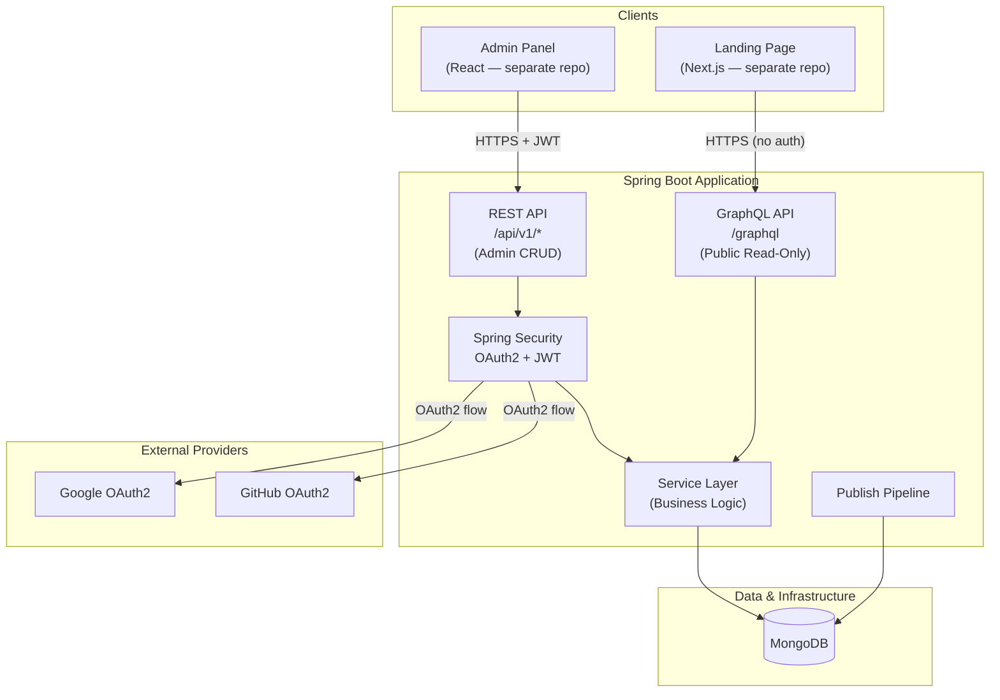
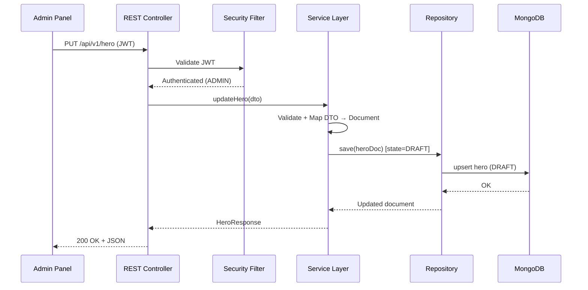
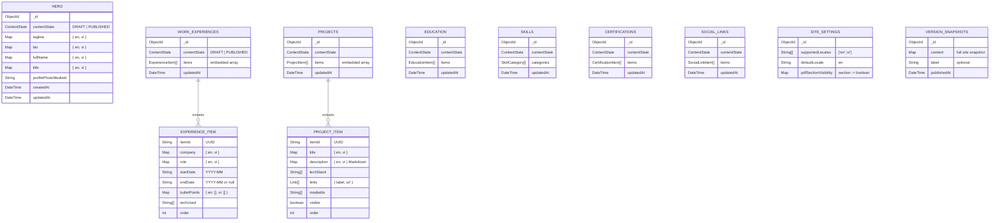
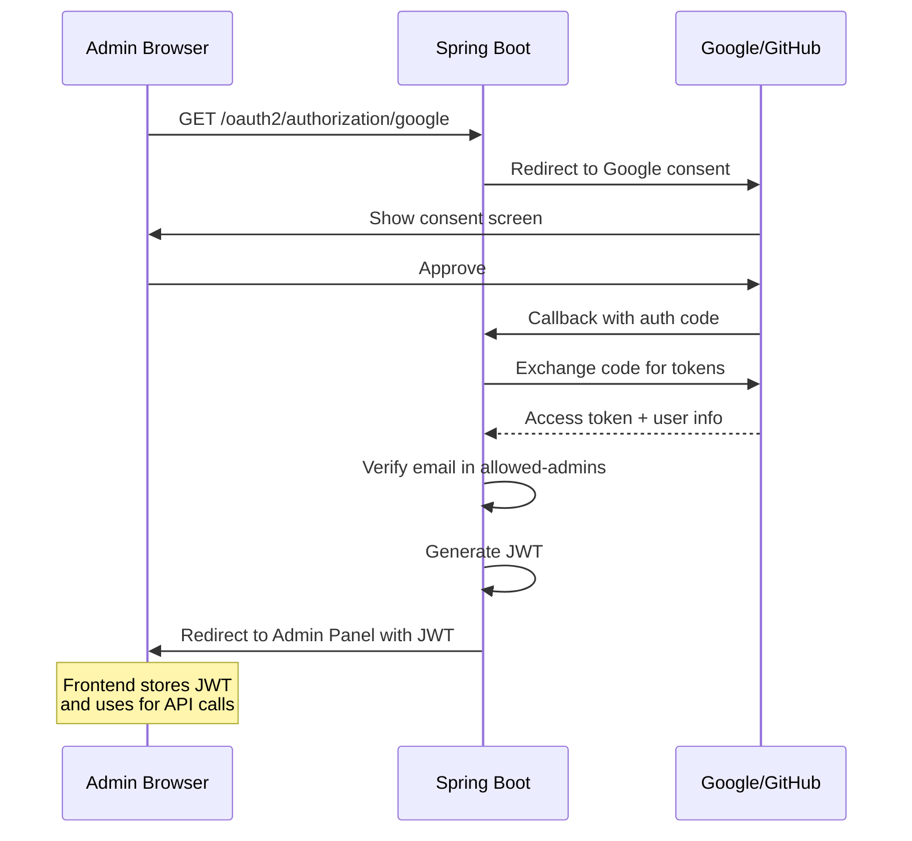
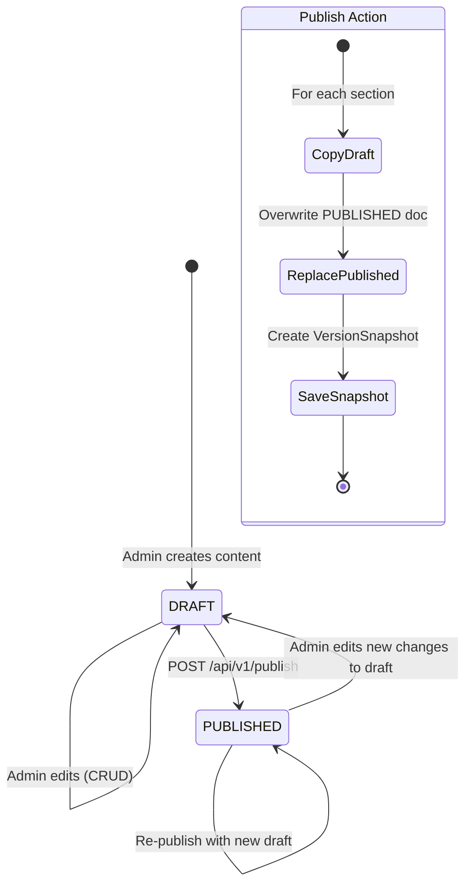

# Phase 1 (MVP) — System Design & Architecture

## 1. Architecture Overview

Phase 1 delivers the **backbone** of the Toby.Résumé backend: structured content management with multi-language support, OAuth2 authentication, a draft/publish pipeline, REST admin API, GraphQL public API, and Docker deployment.

### High-Level Component Diagram



### Request Flow



---

## 2. Tech Stack (Phase 1)

| Layer | Technology | Version / Notes |
|-------|-----------|----------------|
| Framework | Spring Boot | 3.x (Java 17+) |
| Language | Java | 17 LTS |
| Database | MongoDB | 7.x (via Docker) |
| Admin API | Spring Web (REST) | JSON, versioned `/api/v1/` |
| Public API | Spring for GraphQL | Single `/graphql` endpoint |
| Auth | Spring Security OAuth2 Client + JWT | Google + GitHub providers |
| Validation | Jakarta Bean Validation | `spring-boot-starter-validation` |
| Mapping | MapStruct | DTO ↔ Document mapping |
| Boilerplate | Lombok | Reduce verbosity |
| Health | Spring Boot Actuator | `/actuator/health` |
| Build | Maven | Multi-module not needed for MVP |
| Containerization | Docker + Docker Compose | App + MongoDB |

### Key Dependencies (pom.xml)

```xml
<!-- Core -->
spring-boot-starter-web
spring-boot-starter-data-mongodb
spring-boot-starter-graphql
spring-boot-starter-security
spring-boot-starter-oauth2-client
spring-boot-starter-validation
spring-boot-starter-actuator

<!-- JWT -->
io.jsonwebtoken:jjwt-api
io.jsonwebtoken:jjwt-impl
io.jsonwebtoken:jjwt-jackson

<!-- Utilities -->
org.projectlombok:lombok
org.mapstruct:mapstruct
org.mapstruct:mapstruct-processor

<!-- Testing -->
spring-boot-starter-test
spring-security-test
org.testcontainers:mongodb
```

---

## 3. Package Structure (Feature-Based)

```
src/main/java/com/tobyresume/backend/
├── TobyResumeApplication.java
│
├── config/                          # Cross-cutting configuration
│   ├── SecurityConfig.java          # OAuth2 + JWT security chain
│   ├── CorsConfig.java              # CORS origins from config
│   ├── MongoConfig.java             # MongoDB auditing, converters
│   └── GraphQLConfig.java           # GraphQL scalar types, custom DataFetcherExceptionResolver
│
├── security/                        # Authentication domain
│   ├── jwt/
│   │   ├── JwtTokenProvider.java    # Generate & validate JWT
│   │   └── JwtAuthFilter.java       # OncePerRequestFilter
│   ├── oauth2/
│   │   ├── OAuth2SuccessHandler.java  # Issue JWT on OAuth2 success
│   │   ├── OAuth2FailureHandler.java
│   │   └── OAuth2UserService.java     # Load/verify allowed user
│   └── AdminGuard.java             # Check user in allowed-admins list
│
├── common/                          # Shared kernel
│   ├── exception/
│   │   ├── GlobalExceptionHandler.java   # @ControllerAdvice
│   │   ├── ResourceNotFoundException.java
│   │   ├── UnauthorizedException.java
│   │   └── ValidationException.java
│   ├── model/
│   │   ├── ContentState.java        # Enum: DRAFT, PUBLISHED
│   │   ├── BaseDocument.java        # id, createdAt, updatedAt
│   │   └── LocalizedString.java     # Map<String, String> wrapper + validation
│   ├── dto/
│   │   ├── ApiResponse.java         # { success, data, timestamp }
│   │   └── ErrorResponse.java       # { error: { code, message, details } }
│   ├── validation/
│   │   ├── ValidLocaleKeys.java     # Custom annotation
│   │   └── LocaleKeysValidator.java # Ensures only "en"/"vi" keys
│   └── util/
│       └── SlugUtils.java           # Order, ID generation helpers
│
├── content/                         # Content domain (one sub-package per section)
│   ├── hero/
│   │   ├── model/Hero.java          # @Document
│   │   ├── dto/HeroRequest.java
│   │   ├── dto/HeroResponse.java
│   │   ├── HeroMapper.java          # MapStruct
│   │   ├── HeroRepository.java
│   │   ├── HeroService.java
│   │   ├── HeroController.java      # REST (admin)
│   │   └── HeroGraphQL.java         # @QueryMapping (public)
│   ├── experience/
│   │   ├── model/WorkExperience.java     # @Document (contains items[])
│   │   ├── model/ExperienceItem.java     # Embedded POJO
│   │   ├── dto/ExperienceItemRequest.java
│   │   ├── dto/ExperienceItemResponse.java
│   │   ├── ExperienceMapper.java
│   │   ├── ExperienceRepository.java
│   │   ├── ExperienceService.java
│   │   ├── ExperienceController.java
│   │   └── ExperienceGraphQL.java
│   ├── project/                     # Same pattern as experience
│   ├── education/                   # Same pattern
│   ├── skill/                       # Same pattern (categories + items)
│   ├── certification/               # Same pattern
│   └── sociallink/                  # Same pattern
│
├── publish/                         # Draft → Published pipeline
│   ├── model/VersionSnapshot.java   # @Document (future Phase 3, schema ready)
│   ├── PublishService.java          # Orchestrates copy draft → published
│   ├── PublishController.java       # POST /api/v1/publish
│   └── PublishRepository.java       # VersionSnapshot persistence
│
└── settings/                        # Site settings
    ├── model/SiteSettings.java
    ├── dto/SiteSettingsRequest.java
    ├── dto/SiteSettingsResponse.java
    ├── SettingsRepository.java
    ├── SettingsService.java
    └── SettingsController.java
```

**Rationale:** Feature-based packaging groups related code together, making each domain self-contained and easier to navigate. Each sub-package under `content/` follows the same structure pattern (model → dto → mapper → repository → service → controller → graphql).

---

## 4. Data Model (MongoDB Documents)

### 4.1 Multi-Language Strategy

All localizable fields use `Map<String, T>` keyed by locale code (`"en"`, `"vi"`). Validated at the DTO layer with `@ValidLocaleKeys`.

```java
// Simple text field
Map<String, String> tagline;
// { "en": "Full Stack Developer", "vi": "Lập trình viên Full Stack" }

// List of text (e.g., bullet points)
Map<String, List<String>> bulletPoints;
// { "en": ["Led team...", "Built..."], "vi": ["Dẫn dắt...", "Xây dựng..."] }
```

### 4.2 Field-Level Localization Matrix

This table is the **authoritative reference** for which fields are localized `Map<String, T>` vs plain values. Derived from `feature-core-cms.md` validation rules.

| Section | Localized Fields (`Map<String, T>`) | Plain Fields |
|---------|-------------------------------------|-------------|
| **Hero** | `tagline`, `bio`, `fullName`, `title` (all `Map<String, String>`) | `profilePhotoMediaId` (String) |
| **Work Experience** | `company`, `role` (`Map<String, String>`), `bulletPoints` (`Map<String, List<String>>`) | `startDate`, `endDate` (String), `techUsed` (String[]), `order` (int) |
| **Projects** | `title` (`Map<String, String>`), `description` (`Map<String, String>`, Markdown) | `techStack` (String[]), `links` (Link[]), `mediaIds` (String[]), `visible` (boolean), `order` (int) |
| **Education** | `details` only (`Map<String, String>`) | `institution`, `degree`, `field` (String), `startDate`, `endDate` (String), `order` (int) |
| **Skills** | Category `name` (`Map<String, String>`) | Item `name` (String), item `level` (String, optional) |
| **Certifications** | `description` only (`Map<String, String>`, optional) | `title`, `issuer` (String), `date` (String), `url` (String, optional), `order` (int) |
| **Social Links** | _None_ | `platform`, `url`, `icon` (String), `order` (int) |

> **Implementation note:** During implementation, use `Map<String, String>` for localized simple text and `Map<String, List<String>>` for localized list text (e.g., bulletPoints). All other fields are stored as their native Java type. The `@ValidLocaleKeys` validator applies only to Map-typed fields.

### 4.3 Draft/Published Strategy

Each content section collection stores **two documents** — one with `contentState: DRAFT` and one with `contentState: PUBLISHED`. Admin CRUD targets DRAFT; GraphQL queries target PUBLISHED. Publish copies DRAFT → PUBLISHED.



### 4.3 Document Schemas

#### Hero

```json
{
  "_id": "ObjectId",
  "contentState": "DRAFT",
  "tagline": { "en": "Full Stack Developer", "vi": "Lập trình viên Full Stack" },
  "bio": { "en": "Markdown bio...", "vi": "Bio tiếng Việt..." },
  "fullName": { "en": "Toby Nguyen", "vi": "Nguyễn Toby" },
  "title": { "en": "Software Engineer", "vi": "Kỹ sư phần mềm" },
  "profilePhotoMediaId": null,
  "createdAt": "2026-02-11T10:00:00Z",
  "updatedAt": "2026-02-11T10:00:00Z"
}
```

#### Work Experience (container + embedded items)

```json
{
  "_id": "ObjectId",
  "contentState": "DRAFT",
  "items": [
    {
      "itemId": "uuid-exp-001",
      "company": { "en": "TechCorp", "vi": "TechCorp" },
      "role": { "en": "Senior Engineer", "vi": "Kỹ sư cao cấp" },
      "startDate": "2023-01",
      "endDate": null,
      "bulletPoints": {
        "en": ["Led a team of 5 engineers...", "Built microservices..."],
        "vi": ["Dẫn dắt đội 5 kỹ sư...", "Xây dựng microservices..."]
      },
      "techUsed": ["Java", "Spring Boot", "MongoDB"],
      "order": 1
    }
  ],
  "createdAt": "2026-02-11T10:00:00Z",
  "updatedAt": "2026-02-11T10:00:00Z"
}
```

#### Site Settings

```json
{
  "_id": "ObjectId",
  "supportedLocales": ["en", "vi"],
  "defaultLocale": "en",
  "pdfSectionVisibility": {
    "hero": true,
    "experiences": true,
    "projects": true,
    "education": true,
    "skills": true,
    "certifications": true,
    "socialLinks": false
  }
}
```

#### Version Snapshot (Phase 3 ready, schema defined now)

```json
{
  "_id": "ObjectId",
  "content": {
    "hero": { "...full hero document..." },
    "experiences": { "...full experiences document..." },
    "projects": { "..." },
    "education": { "..." },
    "skills": { "..." },
    "certifications": { "..." },
    "socialLinks": { "..." }
  },
  "label": "v1.0 — Initial publish",
  "publishedAt": "2026-02-11T12:00:00Z"
}
```

### 4.4 MongoDB Indexes

| Collection | Index | Purpose |
|-----------|-------|---------|
| `hero` | `{ contentState: 1 }` unique | Exactly one DRAFT, one PUBLISHED |
| `work_experiences` | `{ contentState: 1 }` unique | Same |
| `projects` | `{ contentState: 1 }` unique | Same |
| `education` | `{ contentState: 1 }` unique | Same |
| `skills` | `{ contentState: 1 }` unique | Same |
| `certifications` | `{ contentState: 1 }` unique | Same |
| `social_links` | `{ contentState: 1 }` unique | Same |
| `version_snapshots` | `{ publishedAt: -1 }` | Query latest versions |

---

## 5. REST API Design (Admin)

All admin endpoints are prefixed with `/api/v1/` and require a valid JWT (`Authorization: Bearer <token>`).

### 5.1 Authentication

| Method | Path | Description |
|--------|------|-------------|
| `GET` | `/oauth2/authorization/google` | Initiate Google OAuth2 login |
| `GET` | `/oauth2/authorization/github` | Initiate GitHub OAuth2 login |
| `GET` | `/api/v1/auth/me` | Get current authenticated user |
| `POST` | `/api/v1/auth/logout` | Invalidate session/token |

**OAuth2 Login Flow:**



### 5.2 Content CRUD

#### Hero (Singleton)

| Method | Path | Description |
|--------|------|-------------|
| `GET` | `/api/v1/hero` | Get draft hero |
| `PUT` | `/api/v1/hero` | Create or update draft hero |

#### Work Experience (List)

| Method | Path | Description |
|--------|------|-------------|
| `GET` | `/api/v1/experiences` | List all draft experience items |
| `GET` | `/api/v1/experiences/{itemId}` | Get single experience item |
| `POST` | `/api/v1/experiences` | Add new experience item |
| `PUT` | `/api/v1/experiences/{itemId}` | Update experience item |
| `DELETE` | `/api/v1/experiences/{itemId}` | Delete experience item |
| `PUT` | `/api/v1/experiences/reorder` | Reorder items `{ "orderedIds": ["id1","id2",...] }` |

#### Projects, Education, Certifications, Social Links

Same CRUD pattern as Work Experience (list-based sections):

| Section | Base Path |
|---------|----------|
| Projects | `/api/v1/projects` |
| Education | `/api/v1/education` |
| Certifications | `/api/v1/certifications` |
| Social Links | `/api/v1/social-links` |

#### Skills (Categories + Items)

| Method | Path | Description |
|--------|------|-------------|
| `GET` | `/api/v1/skills` | List all draft skill categories |
| `POST` | `/api/v1/skills` | Add skill category |
| `PUT` | `/api/v1/skills/{categoryId}` | Update category (name + items) |
| `DELETE` | `/api/v1/skills/{categoryId}` | Delete category |
| `PUT` | `/api/v1/skills/reorder` | Reorder categories |

### 5.3 Preview

| Method | Path | Description |
|--------|------|-------------|
| `GET` | `/api/v1/preview` | Get all draft sections as a single payload (for preview rendering) |
| `GET` | `/api/v1/preview?locale=en` | Same, filtered to one locale |

### 5.4 Publish Pipeline

| Method | Path | Description |
|--------|------|-------------|
| `POST` | `/api/v1/publish` | Publish: copy DRAFT → PUBLISHED, create version snapshot |
| `GET` | `/api/v1/publish/status` | Last publish timestamp, version count |

### 5.5 Settings

| Method | Path | Description |
|--------|------|-------------|
| `GET` | `/api/v1/settings` | Get site settings |
| `PUT` | `/api/v1/settings` | Update site settings |

### 5.6 Request / Response Examples

**PUT /api/v1/hero — Request:**
```json
{
  "tagline": { "en": "Full Stack Developer", "vi": "Lập trình viên Full Stack" },
  "bio": { "en": "I build things...", "vi": "Tôi xây dựng..." },
  "fullName": { "en": "Toby Nguyen", "vi": "Nguyễn Toby" },
  "title": { "en": "Software Engineer", "vi": "Kỹ sư phần mềm" },
  "profilePhotoMediaId": null
}
```

**Response (200 OK):**
```json
{
  "success": true,
  "data": {
    "tagline": { "en": "Full Stack Developer", "vi": "Lập trình viên Full Stack" },
    "bio": { "en": "I build things...", "vi": "Tôi xây dựng..." },
    "fullName": { "en": "Toby Nguyen", "vi": "Nguyễn Toby" },
    "title": { "en": "Software Engineer", "vi": "Kỹ sư phần mềm" },
    "profilePhotoMediaId": null,
    "updatedAt": "2026-02-11T10:30:00Z"
  },
  "timestamp": "2026-02-11T10:30:00Z"
}
```

**POST /api/v1/experiences — Request:**
```json
{
  "company": { "en": "TechCorp" },
  "role": { "en": "Senior Engineer" },
  "startDate": "2023-01",
  "endDate": null,
  "bulletPoints": { "en": ["Led a team of 5 engineers..."] },
  "techUsed": ["Java", "Spring Boot"]
}
```

**Error Response (400):**
```json
{
  "error": {
    "code": "VALIDATION_ERROR",
    "message": "Validation failed",
    "details": [
      { "field": "company.en", "message": "Must not exceed 200 characters" },
      { "field": "bulletPoints.en[0]", "message": "Must not exceed 500 characters" }
    ]
  }
}
```

---

## 6. GraphQL API Design (Public)

Single endpoint: `POST /graphql` — **no authentication required**. Only PUBLISHED content is exposed.

### 6.1 Schema

```graphql
# ── Enums ──

enum Locale {
  EN
  VI
}

# ── Root Query ──

type Query {
  hero(locale: Locale): Hero
  experiences(locale: Locale): [ExperienceItem!]!
  projects(locale: Locale): [ProjectItem!]!
  education(locale: Locale): [EducationItem!]!
  skills(locale: Locale): [SkillCategory!]!
  certifications(locale: Locale): [CertificationItem!]!
  socialLinks: [SocialLinkItem!]!
  siteSettings: SiteSettings
}

# ── Types ──

type Hero {
  tagline: String
  bio: String
  fullName: String
  title: String
  profilePhotoUrl: String
}

type ExperienceItem {
  id: ID!
  company: String
  role: String
  startDate: String
  endDate: String
  bulletPoints: [String!]
  techUsed: [String!]
  order: Int!
}

type ProjectItem {
  id: ID!
  title: String
  description: String
  techStack: [String!]
  links: [Link!]
  mediaUrls: [String!]
  visible: Boolean!
  order: Int!
}

type Link {
  label: String!
  url: String!
}

type EducationItem {
  id: ID!
  institution: String
  degree: String
  field: String
  startDate: String
  endDate: String
  details: String
  order: Int!
}

type SkillCategory {
  id: ID!
  name: String
  items: [SkillItem!]!
  order: Int!
}

type SkillItem {
  name: String!
  level: String
}

type CertificationItem {
  id: ID!
  title: String
  issuer: String
  date: String
  url: String
  description: String
  order: Int!
}

type SocialLinkItem {
  id: ID!
  platform: String!
  url: String!
  icon: String
  order: Int!
}

type SiteSettings {
  supportedLocales: [String!]!
  defaultLocale: String!
}
```

**Locale resolution:** When `locale` is provided (e.g., `EN`), resolvers extract only that locale's value from the `Map<String, T>` fields. When omitted, the **default locale** from settings is used.

**List ordering:** All list queries (`experiences`, `projects`, `education`, `skills`, `certifications`, `socialLinks`) return items sorted by the `order` field ascending. Projects are **filtered to `visible: true` only** for the public API.

### 6.2 Draft Preview API

The requirement states the backend must expose draft content so that a frontend preview page (e.g., `/preview`) can render the draft version of the site before publish.

**Design:** Add an authenticated REST endpoint that returns **all draft sections** in a single response, structured identically to the GraphQL public response. This lets the admin panel render a preview without making 7 separate CRUD calls.

| Method | Path | Auth | Description |
|--------|------|------|-------------|
| `GET` | `/api/v1/preview` | JWT (ADMIN) | Get all draft sections as a single payload |
| `GET` | `/api/v1/preview?locale=en` | JWT (ADMIN) | Same, filtered to one locale |

**Response (200 OK):**
```json
{
  "success": true,
  "data": {
    "hero": { "tagline": "...", "bio": "...", "fullName": "...", "title": "...", "profilePhotoUrl": null },
    "experiences": [ { "id": "...", "company": "...", "role": "...", ... } ],
    "projects": [ { "id": "...", "title": "...", ... } ],
    "education": [ ... ],
    "skills": [ ... ],
    "certifications": [ ... ],
    "socialLinks": [ ... ]
  },
  "timestamp": "2026-02-11T10:30:00Z"
}
```

**Rationale:** A single preview endpoint is preferred over gating GraphQL with a `state` parameter because (1) it keeps the public GraphQL surface clean and unauthenticated, and (2) the admin panel can display a full-page preview with one request. The response shape mirrors GraphQL output so the frontend preview renderer can reuse the same components as the landing page.

### 6.3 Example Query

```graphql
query LandingPage($locale: Locale!) {
  hero(locale: $locale) {
    fullName
    title
    tagline
    bio
    profilePhotoUrl
  }
  experiences(locale: $locale) {
    company
    role
    startDate
    endDate
    bulletPoints
    techUsed
  }
  projects(locale: $locale) {
    title
    description
    techStack
    links { label url }
  }
  skills(locale: $locale) {
    name
    items { name level }
  }
  socialLinks {
    platform
    url
    icon
  }
}
```

---

## 7. Authentication & Security

### 7.1 OAuth2 + JWT Flow

1. Admin clicks "Login with Google" → browser navigates to `/oauth2/authorization/google`
2. Spring Security redirects to Google consent screen
3. On approval, Google redirects back with auth code
4. Spring Security exchanges code for access token and fetches user info
5. `OAuth2SuccessHandler` checks user email against **allowed-admins** config list
6. If allowed → generate JWT (24h expiry) → redirect to Admin Panel URL with token as query param (or set as HTTP-only cookie)
7. If not allowed → redirect to Admin Panel with error

### 7.2 JWT Structure

```json
{
  "sub": "toby@example.com",
  "name": "Toby Nguyen",
  "provider": "google",
  "role": "ADMIN",
  "iat": 1739271600,
  "exp": 1739358000
}
```

### 7.3 Security Filter Chain

```java
@Bean
SecurityFilterChain securityFilterChain(HttpSecurity http) {
    return http
        .csrf(csrf -> csrf.disable())             // Stateless API
        .cors(cors -> cors.configurationSource(corsSource))
        .sessionManagement(s -> s.sessionCreationPolicy(STATELESS))
        .authorizeHttpRequests(auth -> auth
            // Public endpoints — no auth
            .requestMatchers("/graphql").permitAll()
            .requestMatchers("/actuator/health").permitAll()
            .requestMatchers("/oauth2/**", "/login/oauth2/**").permitAll()
            // Admin endpoints — require auth
            .requestMatchers("/api/v1/**").authenticated()
            .anyRequest().denyAll()
        )
        .oauth2Login(oauth -> oauth
            .successHandler(oAuth2SuccessHandler)
            .failureHandler(oAuth2FailureHandler)
        )
        .addFilterBefore(jwtAuthFilter, UsernamePasswordAuthenticationFilter.class)
        .build();
}
```

### 7.4 Allowed Admins

```yaml
app:
  security:
    allowed-admins:
      - toby@gmail.com                # Google email
      - toby-github-id                # GitHub user ID or email
    jwt:
      secret: ${JWT_SECRET}           # From environment
      expiration-ms: 86400000         # 24 hours
    oauth2:
      redirect-uri: ${ADMIN_PANEL_URL}/auth/callback
```

### 7.5 Security Rules Summary

| Endpoint Pattern | Auth Required | Role |
|-----------------|--------------|------|
| `POST /graphql` | No | Public |
| `GET /actuator/health` | No | Public |
| `GET /oauth2/**` | No | OAuth flow |
| `GET,PUT /api/v1/hero` | Yes (JWT) | ADMIN |
| `* /api/v1/**` | Yes (JWT) | ADMIN |

---

## 8. Draft / Publish Pipeline

### 8.1 Design



### 8.2 Publish Service Logic

```
POST /api/v1/publish

1. For each content section (hero, experiences, projects, education, skills, certifications, socialLinks):
   a. Read DRAFT document
   b. Deep-copy to a new document with contentState = PUBLISHED
   c. Upsert (replace) the PUBLISHED document
2. Create a VersionSnapshot document containing all sections' published state
3. Update publish metadata (last publish timestamp)
4. Return: { publishedAt, versionId, sectionsPublished: [...] }
```

> **Scope note:** `requirement.md` defines Phase 1 as "no version history." Phase 1 **saves** VersionSnapshot documents on each publish (write-only, for forward compatibility), but **rollback, listing, and diff** are deferred to Phase 3. No REST endpoints for version history are exposed in Phase 1.

### 8.3 Initial State (First Run)

- Database is empty on first startup
- Admin CRUD creates DRAFT documents on first write
- No PUBLISHED documents exist until first `POST /api/v1/publish`
- GraphQL returns `null` / empty arrays for sections with no PUBLISHED document
- Frontend (landing page) handles empty state gracefully

### 8.4 Concurrency

- **Last-write-wins** for MVP (single-user, no optimistic locking)
- If admin edits from multiple tabs simultaneously, last save wins
- Publish is a sequential atomic operation (per section, not across sections — acceptable for single-user)

---

## 9. Error Handling

### 9.1 Global Exception Handler

```java
@RestControllerAdvice
public class GlobalExceptionHandler {

    @ExceptionHandler(ResourceNotFoundException.class)  → 404
    @ExceptionHandler(MethodArgumentNotValidException.class)  → 400 (validation)
    @ExceptionHandler(ConstraintViolationException.class)  → 400
    @ExceptionHandler(UnauthorizedException.class)  → 401
    @ExceptionHandler(AccessDeniedException.class)  → 403
    @ExceptionHandler(Exception.class)  → 500 (catch-all, log full trace)
}
```

### 9.2 Unified Response Envelope

All REST responses use a consistent top-level structure. The client checks `success` first.

**Success:**
```json
{
  "success": true,
  "data": { ... },
  "timestamp": "2026-02-11T10:30:00Z"
}
```

**Error:**
```json
{
  "success": false,
  "error": {
    "code": "RESOURCE_NOT_FOUND",
    "message": "Experience item with id 'uuid-123' not found",
    "details": null
  },
  "timestamp": "2026-02-11T10:30:00Z"
}
```

> **Implementation:** `ApiResponse<T>` wraps both success and error cases. The `data` field is present only on success; `error` is present only on failure. `timestamp` is always present.

### 9.3 GraphQL Error Handling

The REST `@ControllerAdvice` does not apply to GraphQL. A separate error handler is needed.

- **Custom `DataFetcherExceptionResolver`**: Implement a Spring for GraphQL exception resolver that catches exceptions from GraphQL resolvers and maps them to structured GraphQL errors.
- **Error format:** Follow the GraphQL spec errors array. Each error includes `message`, `path`, and `extensions` (with `code`):
  ```json
  {
    "data": { "hero": null },
    "errors": [
      {
        "message": "No published content found",
        "path": ["hero"],
        "extensions": { "code": "NOT_FOUND" }
      }
    ]
  }
  ```
- **Partial data:** Return partial data with errors where applicable (e.g., hero fails but experiences succeed).
- **No internal details:** Never expose stack traces, class names, or internal error messages in GraphQL error responses. Spring for GraphQL defaults to leaking exception class names — override this behavior.
- **No auth errors:** Public GraphQL has no auth, so no 401/403 errors. Only operational errors (not found, internal error) are possible.

### 9.4 Error Codes

| Code | HTTP Status | When |
|------|------------|------|
| `VALIDATION_ERROR` | 400 | Invalid input, missing required fields |
| `INVALID_LOCALE` | 400 | Locale key not in [en, vi] |
| `UNAUTHORIZED` | 401 | Missing or invalid JWT |
| `FORBIDDEN` | 403 | Authenticated but not in allowed-admins |
| `RESOURCE_NOT_FOUND` | 404 | Section item not found |
| `PUBLISH_FAILED` | 500 | Publish pipeline error |
| `INTERNAL_ERROR` | 500 | Unexpected server error |
| `RATE_LIMITED` | 429 | _Phase 2+ — rate limit exceeded_ |

---

## 10. CORS Configuration

```yaml
app:
  cors:
    allowed-origins:
      - ${ADMIN_PANEL_ORIGIN}       # e.g., http://localhost:3000
      - ${LANDING_PAGE_ORIGIN}      # e.g., http://localhost:3001
    allowed-methods: GET, POST, PUT, DELETE, OPTIONS
    allowed-headers: Content-Type, Authorization
    allow-credentials: true          # For OAuth2 cookies if needed
    max-age: 3600
```

---

## 11. Configuration (application.yml)

```yaml
server:
  port: 8080

spring:
  data:
    mongodb:
      uri: ${MONGODB_URI:mongodb://localhost:27017/tobyresume}
  security:
    oauth2:
      client:
        registration:
          google:
            client-id: ${GOOGLE_CLIENT_ID}
            client-secret: ${GOOGLE_CLIENT_SECRET}
            scope: email, profile
          github:
            client-id: ${GITHUB_CLIENT_ID}
            client-secret: ${GITHUB_CLIENT_SECRET}
            scope: user:email
  graphql:
    graphiql:
      enabled: true                 # Dev only
    path: /graphql
    schema:
      locations: classpath:graphql/

app:
  security:
    allowed-admins:
      - ${ADMIN_EMAIL}
    jwt:
      secret: ${JWT_SECRET}
      expiration-ms: 86400000
    oauth2:
      redirect-uri: ${ADMIN_PANEL_URL}/auth/callback
  cors:
    allowed-origins:
      - ${ADMIN_PANEL_ORIGIN:http://localhost:3000}
      - ${LANDING_PAGE_ORIGIN:http://localhost:3001}

management:
  endpoints:
    web:
      exposure:
        include: health, info
  endpoint:
    health:
      show-details: when-authorized
      probes:
        enabled: true
```

---

## 12. Docker Setup

### 12.1 Dockerfile (Multi-Stage Build)

```dockerfile
# Stage 1: Build
FROM eclipse-temurin:17-jdk AS build
WORKDIR /app
COPY pom.xml mvnw ./
COPY .mvn .mvn
RUN ./mvnw dependency:go-offline -B
COPY src src
RUN ./mvnw package -DskipTests -B

# Stage 2: Run
FROM eclipse-temurin:17-jre
RUN apt-get update && apt-get install -y --no-install-recommends curl && rm -rf /var/lib/apt/lists/*
WORKDIR /app
COPY --from=build /app/target/*.jar app.jar
EXPOSE 8080
HEALTHCHECK --interval=30s --timeout=5s --start-period=30s --retries=3 \
  CMD curl -f http://localhost:8080/actuator/health || exit 1
ENTRYPOINT ["java", "-jar", "app.jar"]
```

### 12.2 Docker Compose

```yaml
services:
  app:
    build: .
    ports:
      - "8080:8080"
    environment:
      MONGODB_URI: mongodb://mongo:27017/tobyresume
      JWT_SECRET: ${JWT_SECRET}
      GOOGLE_CLIENT_ID: ${GOOGLE_CLIENT_ID}
      GOOGLE_CLIENT_SECRET: ${GOOGLE_CLIENT_SECRET}
      GITHUB_CLIENT_ID: ${GITHUB_CLIENT_ID}
      GITHUB_CLIENT_SECRET: ${GITHUB_CLIENT_SECRET}
      ADMIN_EMAIL: ${ADMIN_EMAIL}
      ADMIN_PANEL_URL: ${ADMIN_PANEL_URL}
      ADMIN_PANEL_ORIGIN: ${ADMIN_PANEL_ORIGIN}
      LANDING_PAGE_ORIGIN: ${LANDING_PAGE_ORIGIN}
    depends_on:
      mongo:
        condition: service_healthy
    volumes:
      - media-data:/app/media
    healthcheck:
      test: ["CMD", "curl", "-f", "http://localhost:8080/actuator/health"]
      interval: 30s
      timeout: 5s
      retries: 3

  mongo:
    image: mongo:7
    ports:
      - "27017:27017"
    volumes:
      - mongo-data:/data/db
    healthcheck:
      test: ["CMD", "mongosh", "--eval", "db.adminCommand('ping')"]
      interval: 10s
      timeout: 5s
      retries: 5

volumes:
  mongo-data:
  media-data:
```

---

## 13. Design Decisions & Trade-offs

| # | Decision | Rationale | Alternatives Considered |
|---|---------|-----------|------------------------|
| 1 | **Feature-based packaging** | Each content section is self-contained; easier to navigate, extend, and test independently | Layer-based packaging (all controllers in one package) — rejected for poor cohesion at scale |
| 2 | **Two docs per section (DRAFT + PUBLISHED)** | Simple query by `contentState`; atomic publish per section; clean separation | Single doc with nested draft/published — harder to query; separate collections — too many collections |
| 3 | **Embedded items array** for list sections | Resume sections have <20 items; atomic reads; trivial copy on publish | Individual documents per item — complicates publish (must copy all); unnecessary for small lists |
| 4 | **`Map<String, T>` for i18n** | Flexible; validates locale keys at DTO layer; MongoDB stores natively as JSON object | Dedicated `LocalizedString` class — rigid for list fields; separate locale documents — complicates CRUD |
| 5 | **JWT (stateless) after OAuth2** | No server-side session store needed; works well for SPA admin panel; scales trivially | Session-based — requires session store; not needed for single-user SPA |
| 6 | **UUID for embedded item IDs** | Avoids MongoDB ObjectId quirks for embedded items; human-readable | Auto-increment — risky with concurrent array ops; ObjectId — confusing for embedded items |
| 7 | **Full snapshot for version history** | Simple rollback (restore snapshot); storage cost negligible for single-user resume | Diff-based — complex to reconstruct; overkill for this scale |
| 8 | **GraphQL for public, REST for admin** | GraphQL excels for flexible frontend queries (landing page); REST is simpler for CRUD admin ops | All GraphQL — adds mutation complexity; All REST — under-fetching/over-fetching for landing page |

---

## 14. Non-Functional Requirements

### Performance Targets

| Metric | Target |
|--------|--------|
| REST CRUD (p95) | < 500ms |
| GraphQL public query (p95) | < 300ms |
| Publish operation | < 3s (all sections) |
| Application startup | < 15s |

### Health Check

- `GET /actuator/health` — includes MongoDB connectivity check
- Docker HEALTHCHECK directive hits this endpoint
- Liveness/readiness probes enabled (`management.endpoint.health.probes.enabled: true`)

### Logging

- Structured logging (JSON format in production, plain text in dev)
- Log levels configurable via `LOGGING_LEVEL_ROOT` env
- No secrets in logs (JWT secret, OAuth credentials redacted)

---

## 15. Phase 1 Scope Boundary

### In Scope (Phase 1 MVP)

- [x] All 7 content sections: Hero, Experience, Projects, Education, Skills, Certifications, Social Links
- [x] Full REST CRUD for admin (all sections + settings)
- [x] OAuth2 login (Google + GitHub) with JWT
- [x] Draft/Published pipeline with basic publish
- [x] Multi-language storage (manual input, EN + VI)
- [x] GraphQL public API (published content only, projects filtered by `visible`)
- [x] Draft Preview API (authenticated, single-payload for admin preview rendering)
- [x] Site settings (locales, default locale, PDF section visibility config)
- [x] Version snapshot on publish (write-only; rollback/listing deferred to Phase 3)
- [x] Docker + Docker Compose setup
- [x] Health checks (Actuator)
- [x] Standard error handling and CORS

### Deferred to Phase 2+

- [ ] AI translation (Gemini)
- [ ] AI resume tailoring + cover letter
- [ ] PDF generation (OpenPDF)
- [ ] Media upload/management
- [ ] SEO metadata
- [ ] Version history rollback UI
- [ ] Rate limiting enforcement

### Deferred to Phase 3+

- [ ] JD-specific draft variants
- [ ] Analytics / visit tracking
- [ ] Contact form / messaging
- [ ] Webhooks
- [ ] Version diff/compare
- [ ] Advanced PDF templates
