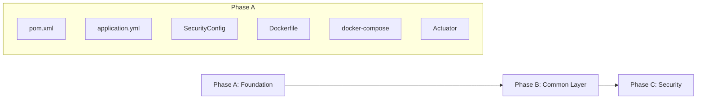
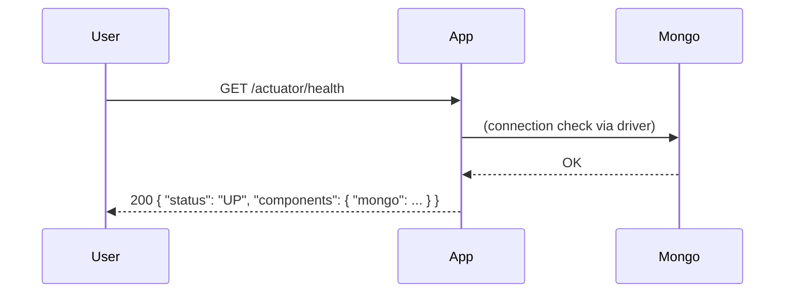
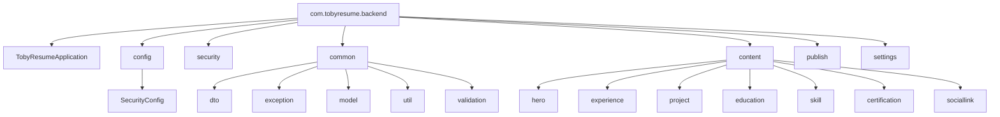

# Knowledge: Phase A — Foundation (Phase 1 MVP)

Structured knowledge for the **Phase A (Foundation)** entry point of the Toby.Résumé backend.

---

## Overview

| Attribute | Value |
|-----------|--------|
| **Purpose** | Runnable Spring Boot app with MongoDB, config, and shared package structure for Phase 1 MVP |
| **Language / Stack** | Java 17, Spring Boot 3.2.5, Maven |
| **Definition of Done (M1 partial)** | App starts; `GET /actuator/health` returns 200; MongoDB status in health; no runtime errors; packages exist |
| **Status** | ✅ **Complete** (A.1–A.8 done) |

**High-level behavior:** The app boots, connects to MongoDB (URI from config/env), exposes Actuator health and info. Security is minimal: all paths permitted so health is reachable before Phase C adds OAuth2/JWT. Dev profile enables GraphiQL, relaxed CORS, and health details without auth.

---

## Implementation Details

### Core Logic and Components

- **Entry point:** `TobyResumeApplication.java` — standard `@SpringBootApplication` with `SpringApplication.run()`.
- **Config:** `application.yml` provides server port, MongoDB URI, OAuth2 client placeholders (Google/GitHub), GraphQL path and schema location, `app.security` (JWT secret, allowed-admins, redirect), `app.cors`, and Actuator (health, info; health details `when-authorized` in base profile).
- **Dev profile:** `application-dev.yml` — GraphiQL enabled, health details `always`, local MongoDB URI, extra CORS origins for localhost/127.0.0.1.
- **Security:** `SecurityConfig` permits `/actuator/**` and all other requests. CSRF disabled. Intent: temporary until Phase C; then `/api/v1/**` will require JWT.
- **Actuator:** Health endpoint includes MongoDB component when app has Mongo configured; dev profile shows details without auth.
- **Package structure:** Feature-based under `com.tobyresume.backend`: `config`, `security`, `common` (dto, exception, model, util, validation), `content/*` (hero, experience, project, education, skill, certification, sociallink), `publish`, `settings`. Placeholder `.gitkeep` files only; no domain logic yet.

### Execution Flow

1. Maven runs `TobyResumeApplication` main.
2. Spring Boot loads `application.yml` and, if `dev` profile active, `application-dev.yml`.
3. Data MongoDB auto-configuration connects using `spring.data.mongodb.uri`.
4. Security filter chain allows all requests; Actuator registers health/info endpoints.
5. `GET /actuator/health` returns 200 with `status: UP` and mongo component when Mongo is reachable.

### Error Handling, Performance, Security

- **Error handling:** No custom exception handling yet (Phase B adds `GlobalExceptionHandler`).
- **Performance:** Not in scope for Phase A.
- **Security:** Everything permitted on purpose; no secrets in repo (env placeholders). `.env.example` documents required variables. JWT secret and OAuth2 credentials must be supplied via env in real runs.

---

## Dependencies

### Internal (project)

| Node | Role |
|------|------|
| `TobyResumeApplication` | Bootstrap |
| `config/SecurityConfig` | Security filter chain (permit all) |
| `application.yml` / `application-dev.yml` | Config and env placeholders |

### External (key dependencies)

- **Spring Boot starters:** web, data-mongodb, graphql, security, oauth2-client, validation, actuator.
- **JJWT** (0.12.5): api, impl, jackson — for Phase C JWT.
- **MapStruct, Lombok:** build-time; used from Phase B onward.
- **MongoDB:** runtime; required for health to show mongo status.

### Excluded / Not Yet Used

- GraphQL schema and resolvers (folder present, empty).
- All `content/*`, `publish`, `settings` logic (packages only).
- OAuth2 login flow (config only; no handlers yet).

---

## Visual Diagrams

### Phase A scope in Phase 1 flow

### Startup and health check

### Package structure (Phase A)

---

## Additional Insights

- **Fix applied:** Invalid `<scope>` on parent POM was removed so the build runs correctly.
- **Docker:** Dockerfile uses Maven image for build (no mvnw in repo). For local run without Docker, use system Maven or add Maven Wrapper.
- **Verification:** Start MongoDB (e.g. `docker compose up mongo -d`), then `mvn spring-boot:run -Dspring-boot.run.profiles=dev` and open `http://localhost:8080/actuator/health`.
- **Risks:** None specific to Phase A. Phase C will replace the permissive security with OAuth2 + JWT and protected `/api/v1/**`.

---

## Metadata

| Field | Value |
|-------|--------|
| **Analysis date** | 2026-02-12 |
| **Depth** | Entry point = Phase A (whole phase); files read: 1 (application), config, security, docker, compose |
| **Files touched** | `pom.xml`, `TobyResumeApplication.java`, `config/SecurityConfig.java`, `application.yml`, `application-dev.yml`, `Dockerfile`, `docker-compose.yml` |
| **Plan reference** | `docs/ai/planning/implementation-plan-phase1-mvp.md` § Phase A (A.1–A.8) |

---

## Next Steps

1. **Phase B (Common Layer):** B.1 `ContentState` enum → B.2 `BaseDocument` + auditing → B.3 `ApiResponse`/error envelope → B.4 `GlobalExceptionHandler` → B.5 custom exceptions → B.6 `@ValidLocaleKeys` → B.7 CORS config → B.8 UUID helper. Completes M1.
2. **Phase C (Security & Auth):** OAuth2 + JWT, protect `/api/v1/**`, implement `/api/v1/auth/me` and logout.
3. **Related knowledge captures:** Consider `/capture-knowledge` for entry points: `TobyResumeApplication` (bootstrap), `SecurityConfig` (security filter), or `application.yml` (config contract) for deeper dives.

---

*Generated as part of the Knowledge Capture workflow for Phase 1 MVP.*
