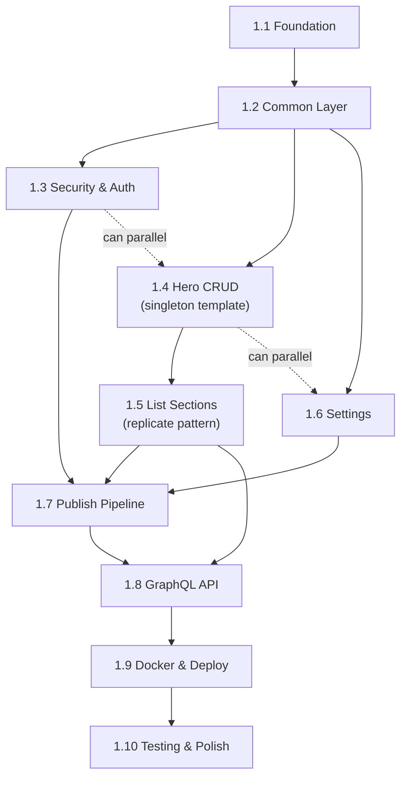

# Project Planning — Phase 1 (MVP) Task Breakdown

> **Detailed implementation plan:** See **`implementation-plan-phase1-mvp.md`** in this folder for step-by-step tasks, dependencies, and design doc references. The plan is the single source of truth for implementing Phase 1 from design.

## Milestones

- [ ] **M1: Project Foundation** — Spring Boot project initialized, dependencies configured, Docker Compose running
- [ ] **M2: Security & Auth** — OAuth2 (Google + GitHub) login working, JWT issued, admin endpoints protected
- [ ] **M3: Content CRUD** — All 7 content sections with REST CRUD on DRAFT state
- [ ] **M4: Publish Pipeline** — Draft → Published copy, version snapshot saved
- [ ] **M5: GraphQL Public API** — Published content served via GraphQL with locale filtering
- [ ] **M6: Docker & Deploy** — Production-ready Docker image, health checks, structured logging
- [ ] **M7: Testing & Polish** — Unit + integration tests, API documentation, edge case handling

---

## Task Breakdown

### Phase 1.1: Project Foundation (M1)

- [ ] **1.1.1** Generate Spring Boot project (Maven, Java 17, Spring Boot 3.x)
- [ ] **1.1.2** Add all Phase 1 dependencies to `pom.xml` (see design doc Section 2)
- [ ] **1.1.3** Create package structure (feature-based: config, security, common, content, publish, settings)
- [ ] **1.1.4** Configure `application.yml` and `application-dev.yml` (MongoDB, server port, logging)
- [ ] **1.1.5** Create `docker-compose.yml` with MongoDB service (dev environment)
- [ ] **1.1.6** Verify app starts and connects to MongoDB
- [ ] **1.1.7** Configure Spring Boot Actuator (`/actuator/health` with MongoDB check)

### Phase 1.2: Common Layer (M1)

- [ ] **1.2.1** Create `ContentState` enum (DRAFT, PUBLISHED)
- [ ] **1.2.2** Create `BaseDocument` (id, createdAt, updatedAt with MongoDB auditing)
- [ ] **1.2.3** Create `ApiResponse<T>` and `ErrorResponse` DTOs
- [ ] **1.2.4** Create `GlobalExceptionHandler` (@ControllerAdvice) with standard error mapping
- [ ] **1.2.5** Create `@ValidLocaleKeys` annotation + validator (ensures only "en"/"vi" keys)
- [ ] **1.2.6** Configure CORS (from `app.cors.*` properties)
- [ ] **1.2.7** Create UUID utility for embedded item IDs

### Phase 1.3: Security & Authentication (M2)

- [ ] **1.3.1** Configure Spring Security OAuth2 Client (Google + GitHub providers)
- [ ] **1.3.2** Implement `JwtTokenProvider` (generate, parse, validate HS256 tokens)
- [ ] **1.3.3** Implement `JwtAuthFilter` (extract Bearer token, set SecurityContext)
- [ ] **1.3.4** Implement `OAuth2SuccessHandler` (verify allowed-admin, generate JWT, redirect)
- [ ] **1.3.5** Implement `OAuth2FailureHandler` (redirect with error)
- [ ] **1.3.6** Implement `AdminGuard` / allowed-admin email check
- [ ] **1.3.7** Configure `SecurityFilterChain` (public vs protected endpoint rules)
- [ ] **1.3.8** Implement `GET /api/v1/auth/me` endpoint
- [ ] **1.3.9** Implement `POST /api/v1/auth/logout` endpoint
- [ ] **1.3.10** Test OAuth2 flow end-to-end (manual + integration test)

### Phase 1.4: Content CRUD — Singleton Section (M3)

Start with **Hero** as the template for singleton sections.

- [ ] **1.4.1** Create `Hero` document model (MongoDB @Document, all fields with localized maps)
- [ ] **1.4.2** Create `HeroRequest` / `HeroResponse` DTOs with validation annotations
- [ ] **1.4.3** Create `HeroMapper` (MapStruct)
- [ ] **1.4.4** Create `HeroRepository` (Spring Data MongoDB: `findByContentState`)
- [ ] **1.4.5** Create `HeroService` (get draft, upsert draft)
- [ ] **1.4.6** Create `HeroController` (GET + PUT `/api/v1/hero`)
- [ ] **1.4.7** Write unit tests for HeroService
- [ ] **1.4.8** Write integration tests for HeroController (MockMvc)

### Phase 1.5: Content CRUD — List Sections (M3)

Use **Experience** as the template, then replicate for other list sections.

- [ ] **1.5.1** Create `WorkExperience` document model (embedded `ExperienceItem` array)
- [ ] **1.5.2** Create `ExperienceItem` embedded model (itemId, localized fields, order)
- [ ] **1.5.3** Create DTOs (ExperienceItemRequest, ExperienceItemResponse)
- [ ] **1.5.4** Create `ExperienceMapper`
- [ ] **1.5.5** Create `ExperienceRepository`
- [ ] **1.5.6** Create `ExperienceService` (list, add, update, delete, reorder items in DRAFT)
- [ ] **1.5.7** Create `ExperienceController` (full CRUD + reorder)
- [ ] **1.5.8** Write unit + integration tests for Experience
- [ ] **1.5.9** Replicate pattern for **Projects** (same structure + `visible`, `links`, `mediaIds`)
- [ ] **1.5.10** Replicate pattern for **Education**
- [ ] **1.5.11** Replicate pattern for **Certifications**
- [ ] **1.5.12** Replicate pattern for **Social Links**
- [ ] **1.5.13** Implement **Skills** section (categories with nested items — slightly different structure)

### Phase 1.6: Settings (M3)

- [ ] **1.6.1** Create `SiteSettings` document model (locales, default locale, PDF section visibility)
- [ ] **1.6.2** Create DTOs and mapper
- [ ] **1.6.3** Create `SettingsRepository` and `SettingsService`
- [ ] **1.6.4** Create `SettingsController` (GET + PUT `/api/v1/settings`)
- [ ] **1.6.5** Initialize default settings on first run (if not exists)

### Phase 1.6b: Preview API (M4)

- [ ] **1.6b.1** Create `PreviewService` (aggregate all DRAFT sections; optional locale filter)
- [ ] **1.6b.2** Create `PreviewController` (GET `/api/v1/preview`, GET `/api/v1/preview?locale=en`)
- [ ] **1.6b.3** Response shape matches api-design (single payload for admin preview page)

### Phase 1.7: Publish Pipeline (M4)

- [ ] **1.7.1** Create `VersionSnapshot` document model (full content snapshot, label, publishedAt)
- [ ] **1.7.2** Create `PublishRepository` (VersionSnapshot CRUD)
- [ ] **1.7.3** Implement `PublishService` (orchestrate: read all DRAFT → copy to PUBLISHED → save snapshot)
- [ ] **1.7.4** Create `PublishController` (POST `/api/v1/publish`, GET `/api/v1/publish/status`)
- [ ] **1.7.5** Handle edge cases: empty sections, partial content, first publish
- [ ] **1.7.6** Write integration tests for publish flow

### Phase 1.8: GraphQL Public API (M5)

- [ ] **1.8.1** Create GraphQL schema file (`src/main/resources/graphql/schema.graphqls`)
- [ ] **1.8.2** Configure Spring for GraphQL (path, GraphiQL for dev)
- [ ] **1.8.3** Implement `HeroGraphQL` resolver (@QueryMapping, locale filtering)
- [ ] **1.8.4** Implement resolvers for all list sections (experiences, projects, education, skills, certifications, socialLinks)
- [ ] **1.8.5** Implement `SiteSettingsGraphQL` resolver
- [ ] **1.8.6** Handle locale parameter: filter to single locale or use default
- [ ] **1.8.7** Handle empty state: return null/empty arrays when no published content
- [ ] **1.8.8** Write integration tests for GraphQL queries

### Phase 1.9: Docker & Deployment (M6)

- [ ] **1.9.1** Create multi-stage `Dockerfile` (build + runtime)
- [ ] **1.9.2** Create production `docker-compose.yml` (app + MongoDB + volumes)
- [ ] **1.9.3** Create `.env.example` with all required environment variables
- [ ] **1.9.4** Configure structured logging (JSON in production profile)
- [ ] **1.9.5** Verify health check chain (Docker → Actuator → MongoDB)
- [ ] **1.9.6** Test full build and deployment cycle

### Phase 1.10: Testing & Polish (M7)

- [ ] **1.10.1** Add Testcontainers for MongoDB integration tests
- [ ] **1.10.2** Ensure all services have unit tests (target: 80%+ coverage)
- [ ] **1.10.3** Ensure all controllers have integration tests
- [ ] **1.10.4** Test OAuth2 flow (mock OAuth2 providers in tests)
- [ ] **1.10.5** Test edge cases: empty DB, invalid input, concurrent edits, unauthorized access
- [ ] **1.10.6** Review and finalize error messages and response codes
- [ ] **1.10.7** Add API documentation (Springdoc/OpenAPI for REST; GraphiQL for GraphQL)

---

## Dependencies (Execution Order)

**Key dependency notes:**
- Security (1.3) and Content CRUD (1.4–1.5) can be developed in parallel after Common Layer
- Preview API (1.6b) requires all content sections and Settings to be implemented
- Publish Pipeline (1.7) requires Content CRUD to be functional
- GraphQL (1.8) requires content sections and publish to be working (reads PUBLISHED data)
- Docker (1.9) can start early (Dockerfile skeleton) but finalized after all features work

**Design references:**
- Implementation steps and order: `implementation-plan-phase1-mvp.md`
- System architecture: `docs/ai/design/phase1-mvp.md`
- Database schemas: `docs/ai/design/database-design.md`
- API contracts: `docs/ai/design/api-design.md`

---

## Timeline & Estimates

| Phase | Estimated Effort | Notes |
|-------|-----------------|-------|
| 1.1 Foundation | 0.5 day | Boilerplate + config |
| 1.2 Common Layer | 0.5 day | Shared code, reusable across features |
| 1.3 Security & Auth | 1.5 days | OAuth2 + JWT is the most complex piece |
| 1.4 Hero CRUD | 0.5 day | Establishes the pattern |
| 1.5 List Sections | 2 days | 5 sections × replicate + Skills variant |
| 1.6 Settings | 0.5 day | Simple CRUD |
| 1.7 Publish Pipeline | 1 day | Core logic + edge cases |
| 1.8 GraphQL API | 1 day | Schema + resolvers + locale filtering |
| 1.9 Docker & Deploy | 0.5 day | Dockerfile + compose |
| 1.10 Testing & Polish | 2 days | Comprehensive tests + polish |
| **Total** | **~10 days** | Buffer: +2 days for unknowns |

---

## Risks & Mitigation

| Risk | Impact | Mitigation |
|------|--------|-----------|
| OAuth2 provider config complexity | Could block admin access | Start with Google first (simpler); add GitHub after Google works. Use Spring Security test utilities for CI. |
| MongoDB embedded array update complexity | Could slow development | Prototype with Hero (simple) first; use MongoTemplate for complex array operations if Spring Data is insufficient. |
| GraphQL + Spring Security conflict | GraphQL endpoint might require unexpected auth config | Explicitly permit `/graphql` in SecurityFilterChain; test early. |
| JWT token management edge cases | Token expiry during long admin sessions | Set 24h expiry for MVP; add refresh token mechanism in Phase 2 if needed. |
| Feature creep (Phase 2 features leaking in) | Delays MVP | Strict scope boundary defined in design doc Section 15; defer all AI, PDF, media, SEO, analytics, webhooks, contact to Phase 2+. |

---

## Resources Needed

| Resource | Purpose |
|----------|---------|
| Google Cloud Console project | OAuth2 client credentials (Google provider) |
| GitHub OAuth App | OAuth2 client credentials (GitHub provider) |
| Docker Desktop (or Docker Engine) | Local development with MongoDB |
| Java 17 JDK | Development & build |
| Maven | Build tool |
| IDE (IntelliJ IDEA recommended) | Development |
| Postman / Insomnia | API testing during development |
| GraphiQL (built-in) | GraphQL testing during development |
