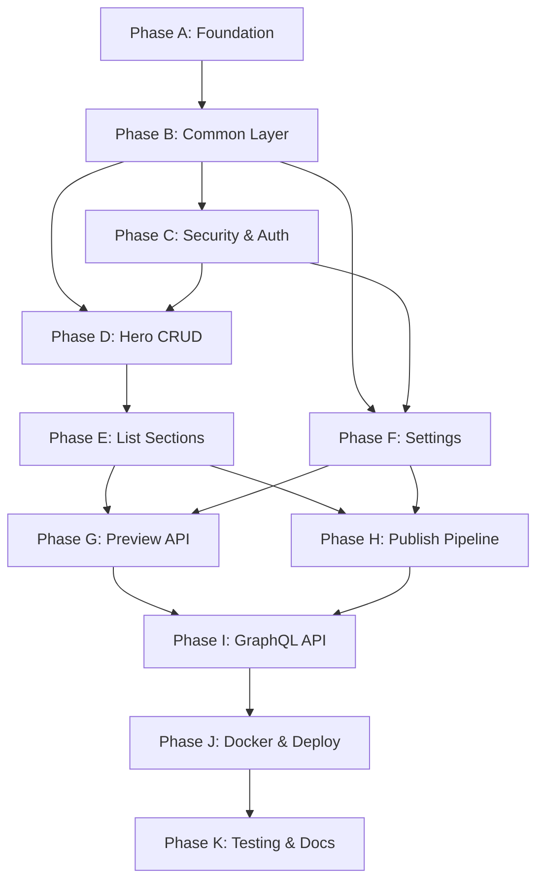

# Implementation Plan — Phase 1 (MVP)

This plan is derived from:

- **System design:** `docs/ai/design/phase1-mvp.md`
- **Database design:** `docs/ai/design/database-design.md`
- **API design:** `docs/ai/design/api-design.md`

---

## 1. Overview

| Goal | Deliverable |
|------|-------------|
| **Backend** | Spring Boot 3.x app: REST admin API, GraphQL public API, OAuth2 + JWT, draft/publish, Docker |
| **Scope** | 7 content sections (Hero, Experience, Projects, Education, Skills, Certifications, Social Links), Settings, Preview, Publish pipeline |
| **Out of scope** | AI, PDF, media upload, SEO, analytics, contact form, webhooks, version rollback UI |

### 1.1 Milestones

| ID | Milestone | Definition of Done |
|----|-----------|--------------------|
| **M1** | Project Foundation | App starts, connects to MongoDB, Actuator health OK, package structure in place |
| **M2** | Security & Auth | Google (and optionally GitHub) OAuth2 → JWT; `/api/v1/**` protected; `/api/v1/auth/me` works |
| **M3** | Content CRUD | All 7 sections: REST CRUD on DRAFT; validation and error envelope as per API design |
| **M4** | Preview & Publish | `GET /api/v1/preview` returns full draft; `POST /api/v1/publish` copies DRAFT→PUBLISHED and creates snapshot |
| **M5** | GraphQL Public API | Schema deployed; resolvers return PUBLISHED data with locale; projects filtered by `visible` |
| **M6** | Settings | GET/PUT `/api/v1/settings`; bootstrap default on first run |
| **M7** | Docker & Deploy | Dockerfile + docker-compose; health checks; env-based config |
| **M8** | Testing & Docs | Unit + integration tests; OpenAPI/GraphiQL or equivalent docs |

---

## 1.2 Planning Update (2026-02-13)

### Current Status: Phase 1 (MVP)

#### Done
- [x] **Phase A (Foundation) — M1 partial** — A.1–A.8 complete. Maven project (Java 17, Spring Boot 3.2.5), all Phase 1 dependencies, package structure, `application.yml` / `application-dev.yml`, `docker-compose.yml`, Dockerfile, Actuator (health + info, MongoDB). Minimal `SecurityConfig` permits `/actuator/**`. Verified: compile, MongoDB via Docker, app start with dev profile, `GET /actuator/health` 200 with mongo UP. Fix applied: removed invalid `<scope>` from parent in `pom.xml`.
- [x] **Phase B (Common Layer) — M1 complete** — B.1–B.8 complete. `ContentState` enum; `BaseDocument` + `MongoConfig` (@EnableMongoAuditing); `ApiResponse<T>` and `ErrorBody` (with `FieldErrorDetail`); `GlobalExceptionHandler` (400, 401, 403, 404, 500; MethodArgumentNotValidException → validation details); custom exceptions (`ResourceNotFoundException`, `UnauthorizedException`, `ValidationException`, `ForbiddenException`); `@ValidLocaleKeys` and `LocaleKeysValidator`; `CorsConfig` from `app.cors.*` (SecurityConfig uses cors with defaults); `IdGenerator.uuid()`. Verified: `mvn compile` succeeds.

- [x] **Phase C (Security & Auth) — M2 complete** — C.1–C.10 complete. OAuth2 Google + GitHub in `application.yml`; `JwtTokenProvider` (HS256, sub, name, provider, role, iat, exp); `JwtAuthFilter` (Bearer, SecurityContext with `AuthPrincipal`); `OAuth2SuccessHandler` (allowed-admins check, JWT, redirect with `?token=`); `OAuth2FailureHandler` (redirect with `?error=access_denied`); `SecurityConfig` (permit `/graphql`, `/actuator/**`, `/oauth2/**`, `/login/oauth2/**`; require auth for `/api/v1/**`; stateless; entry point + access denied handler return JSON envelope); `AuthController` (GET `/api/v1/auth/me`, POST `/api/v1/auth/logout`); `AppSecurityProperties` for `allowed-admins` and redirect-uri; `GlobalExceptionHandler` handles `AccessDeniedException` → 403. Verified: `mvn compile` succeeds.
- [x] **Phase F (Settings) — M6 complete** — F.1–F.4 complete. `SiteSettings` document (supportedLocales, defaultLocale, pdfSectionVisibility); `SiteSettingsRequest` / `SiteSettingsResponse` DTOs; `SettingsMapper` (entity→response); `SettingsRepository` (findSingleton); `SettingsService` (getOrCreate bootstrap, update with validation: supportedLocales exactly ["en","vi"], defaultLocale in supportedLocales, pdfSectionVisibility keys fixed); `SettingsController` (GET/PUT `/api/v1/settings`). Verified: `mvn compile` succeeds.
- [x] **Phase D (Content CRUD — Hero) — M3 partial** — D.1–D.8 complete. `Hero` document (unique index on contentState); `HeroRequest`/`HeroResponse` with `@ValidLocaleKeys` and `@MapValueMaxLength`; `HeroMapper`, `HeroRepository`, `HeroService`, `HeroController` (GET/PUT `/api/v1/hero`); unit tests (HeroServiceTest); integration tests (HeroControllerIntegrationTest with Testcontainers MongoDB, `@Order` for test order). `ApiResponse` updated so `data` is always present on success (null when no hero). Verified: `mvn test -Dtest=HeroServiceTest,HeroControllerIntegrationTest` passes.
- [x] **Phase E (Content CRUD — List Sections) — M3 complete** — E.1–E.8 done. **Experience**: WorkExperience + ExperienceItem; DTOs with @ValidBulletPoints; 6 endpoints; unit + integration tests. **Projects**: Project + ProjectItem; Link/LinkDto; 6 endpoints; unit + integration tests. **Education**: Education + EducationItem (institution, degree, field, startDate/endDate, details); 6 endpoints. **Certifications**: Certification + CertificationItem (title, issuer, date, url, description); 6 endpoints. **Social Links**: SocialLink + SocialLinkItem (platform, url, icon); `/api/v1/social-links`; 6 endpoints. **Skills**: Skill + SkillCategory (categoryId, name, items List&lt;SkillItem&gt;); GET/POST/PUT/DELETE /skills, GET /skills/{categoryId}, PUT /skills/reorder; max 50 items per category. All list sections use ReorderRequest and same getOrCreateDraft/list/get/add/update/delete/reorder pattern. Verified: `mvn test` passes.
- [x] **Phase G (Preview API) — M4 partial** — G.1–G.3 complete. `PreviewService` aggregates all DRAFT sections (hero, experiences, projects, education, skills, certifications, socialLinks); optional locale filter (`?locale=en` or `vi`) returns single-locale values per field. `PreviewController`: GET `/api/v1/preview` (JWT required). Response shape per api-design §5.1 (GraphQL-friendly for frontend reuse). Verified: `mvn compile` succeeds.
- [x] **Phase H (Publish Pipeline) — M4 complete** — H.1–H.6 complete. `VersionSnapshot` (content, label, publishedAt); `PublishRepository` (save, findTop1ByOrderByPublishedAtDesc, count); `PublishService` (publish: copy DRAFT→PUBLISHED for all 7 sections via clone/empty, build snapshot, save; getStatus); missing DRAFT treated as empty PUBLISHED; `PublishFailedException` + handler (500 PUBLISH_FAILED); `PublishController` (POST `/api/v1/publish` optional body label, GET `/api/v1/publish/status`); `PublishControllerIntegrationTest` (Testcontainers). Verified: `mvn compile` and `mvn test -Dtest=PublishControllerIntegrationTest` pass.
- [x] **Phase I (GraphQL Public API) — M5 complete** — I.1–I.8 complete. `schema.graphqls` (Locale enum, Query with hero, experiences, projects, education, skills, certifications, socialLinks, siteSettings); Spring GraphQL config in application.yml (path /graphql, schema location; GraphiQL enabled in dev). `ContentGraphQLController`: all @QueryMapping resolvers; locale from argument or settings default; single-locale view. Services extended with getPublished() / listPublished() / listPublishedVisible() (projects). GraphQL model types in `graphql.model`; `GraphQLExceptionResolver` (DataFetcherExceptionResolverAdapter) maps NOT_FOUND, VALIDATION_ERROR, INTERNAL_ERROR; no stack traces. Empty state: null hero, empty lists. Verified: `mvn compile` and `mvn test` pass.
- [x] **Phase J (Docker & Deploy) — M7 complete (v2 — Jenkins CI/CD pipeline)** — J.1–J.4 complete + J.5–J.8 added (2026-02-13). **Architecture redesigned**: infrastructure (MongoDB + Jenkins) runs via `docker-compose.yml` (always on); backend app is built and deployed by the Jenkins pipeline (not in compose). **Jenkinsfile rewritten** with 6-stage pipeline: Checkout (fetch latest from Git) → Stop App (stop/remove `tobyresume-app` container) → DB Migration (detect and run new `.js` mongosh scripts from `deploy/db-migrations/`, tracked in `_schema_migrations` collection) → Build (`docker build` multi-stage image, tagged by build number) → Deploy (`docker run` on `tobyresume-network` with `--env-file` and `--restart unless-stopped`) → Health Check (poll `/actuator/health` up to 150s). Fail-fast on any error; warnings logged without stopping. **Custom Jenkins image** (`deploy/jenkins/Dockerfile`): Jenkins LTS + Docker CLI (docker.io), enables pipeline to manage Docker containers via mounted socket. **docker-compose.yml** now defines infrastructure only (mongo + jenkins) with explicit container names (`tobyresume-mongo`, `tobyresume-jenkins`), explicit network name (`tobyresume-network`), explicit volume names. **docker-compose.dev.yml** added for local dev (mongo + app, no Jenkins). **docker-compose.jenkins.yml removed** (merged into main compose). **Deploy scripts restructured**: `start-infra` (start MongoDB + Jenkins), `deploy-dev` (dev mode: mongo + app), `down` (stop all + Jenkins-deployed app), `test-after-deploy` (smoke tests). Old scripts (`deploy`, `deploy-with-jenkins`) removed. **DB migrations**: `deploy/db-migrations/` directory with README; numbered `.js` scripts; pipeline checks `_schema_migrations` collection for idempotent execution. **Env handling**: pipeline copies `.env.example` to `$JENKINS_HOME/tobyresume.env` on first deploy; persists across builds via Jenkins volume; `MONGODB_URI` set automatically. Dockerfile unchanged. All documentation updated.

#### In Progress
- [ ] **Phase K (Testing & Documentation)** — Next up.

#### Blocked
- None.

#### Newly Discovered Work
- [ ] **J.9** — Verify Jenkins pipeline end-to-end on target server (first real "Build Now" test).
- [ ] **J.10** — Configure Jenkins credentials for private Git repo (if needed).
- [ ] **J.11** — Set production values in `$JENKINS_HOME/tobyresume.env` after first deploy.

#### Next 2–3 Tasks
1. **J.9** — Verify Jenkins pipeline end-to-end (start infra, configure job, Build Now, check health).
2. **K.1** — Testcontainers (MongoDB) for integration tests.
3. **K.2** — Unit tests: all services (target 80%+ coverage).

**Summary for planning:** Phase A–J are complete. M7 (Docker & Deploy) **redesigned on 2026-02-13**: Jenkins now performs full CI/CD (checkout → stop → migrate → build → deploy → health check) instead of just building a JAR. Infrastructure (MongoDB + Jenkins) separated from app deployment. Next: verify pipeline E2E, then Phase K (Testing & Documentation).

---

## 2. Implementation Phases (Execution Order)

### Phase A: Foundation (M1)

**Objective:** Runnable Spring Boot app, MongoDB, config, and shared code.

| Step | Task | Reference | Output / Checklist |
|------|------|-----------|--------------------|
| A.1 | Create Maven project (Java 17, Spring Boot 3.x) | phase1-mvp §2 | `pom.xml`, `TobyResumeApplication.java` |
| A.2 | Add dependencies: web, data-mongodb, graphql, security, oauth2-client, validation, actuator, jjwt, mapstruct, lombok | phase1-mvp §2 | All starters + JJWT + MapStruct in `pom.xml` |
| A.3 | Create package structure: `config`, `security`, `common`, `content/*`, `publish`, `settings` | phase1-mvp §3 | Empty packages under `com.tobyresume.backend` |
| A.4 | Configure `application.yml`: server, `spring.data.mongodb.uri`, `spring.security.oauth2.client`, `spring.graphql`, `app.security`, `app.cors`, `management` | phase1-mvp §11 | Env placeholders for JWT_SECRET, GOOGLE_*, GITHUB_*, ADMIN_EMAIL, etc. |
| A.5 | Add `application-dev.yml` (optional): local MongoDB, relaxed CORS, GraphiQL enabled | — | Dev profile |
| A.6 | Add `docker-compose.yml` (dev): MongoDB 7 + app (or app only, MongoDB local) | phase1-mvp §12.2 | `mongo` service + `mongo-data` volume |
| A.7 | Configure Actuator: expose `health`, `info`; health shows MongoDB status | phase1-mvp §14 | `GET /actuator/health` returns UP with mongo detail |
| A.8 | Verify: `mvn spring-boot:run` and `GET /actuator/health` OK | — | Green run |

**Definition of Done M1:** App starts; health endpoint returns 200; no runtime errors; packages exist.

**Phase A status:** ✅ Complete. Minimal `SecurityConfig` added to permit `/actuator/**` so health returns 200 before Phase C. Dockerfile uses Maven image (no mvnw in repo). `.env.example` added. To verify locally: install Maven or add Maven Wrapper, then `mvn spring-boot:run -Dspring-boot.run.profiles=dev` and open `http://localhost:8080/actuator/health`. For MongoDB in health response, start MongoDB (e.g. `docker compose up mongo -d`) first.

---

### Phase B: Common Layer (M1)

**Objective:** Shared models, DTOs, validation, exception handling, CORS.

| Step | Task | Reference | Output / Checklist |
|------|------|-----------|--------------------|
| B.1 | Create `ContentState` enum (DRAFT, PUBLISHED) | database-design §4.1 | `common/model/ContentState.java` |
| B.2 | Create `BaseDocument`: id, createdAt, updatedAt; enable MongoDB auditing | database-design §4.2, phase1-mvp §3 | `common/model/BaseDocument.java`, `MongoConfig` auditing |
| B.3 | Create `ApiResponse<T>` (success, data, timestamp) and error branch (success, error, timestamp) | api-design §2 | `common/dto/ApiResponse.java` (or wrapper + ErrorBody) |
| B.4 | Create `GlobalExceptionHandler` (@ControllerAdvice): map exceptions to error envelope and HTTP status | api-design §2.3, phase1-mvp §9 | 400, 401, 403, 404, 500; validation details in `error.details` |
| B.5 | Create custom exceptions: `ResourceNotFoundException`, `UnauthorizedException`, `ValidationException` | — | Thrown by services; handled in B.4 |
| B.6 | Create `@ValidLocaleKeys` and `LocaleKeysValidator` (allow only "en", "vi") | database-design §3, phase1-mvp §3 | `common/validation/` |
| B.7 | Create CORS config from `app.cors.*` (origins, methods, headers, credentials) | api-design §1.2, phase1-mvp §10 | `config/CorsConfig.java` |
| B.8 | Create UUID helper for embedded item IDs (e.g. `IdGenerator.uuid()`) | phase1-mvp §3 | `common/util/` |

**Definition of Done:** All REST error responses use the unified envelope; CORS allows configured origins; locale validator rejects invalid keys.

**Phase B status:** ✅ Complete. `ForbiddenException` added for 403. Security filter chain updated to use `.cors(Customizer.withDefaults())` so `CorsConfig` bean is applied.

---

### Phase C: Security & Auth (M2)

**Objective:** OAuth2 (Google, then GitHub), JWT issue/validate, protect `/api/v1/**`.

| Step | Task | Reference | Output / Checklist |
|------|------|-----------|--------------------|
| C.1 | Configure OAuth2 client: Google (client-id, client-secret, scope email+profile) | phase1-mvp §7.4 | `application.yml` under `spring.security.oauth2.client.registration.google` |
| C.2 | Implement `JwtTokenProvider`: generate (HS256), parse, validate; claims: sub, name, provider, role, iat, exp | api-design §3.2, phase1-mvp §7.2 | `security/jwt/JwtTokenProvider.java` |
| C.3 | Implement `JwtAuthFilter`: read `Authorization: Bearer <token>`, validate, set SecurityContext | phase1-mvp §7.3 | `security/jwt/JwtAuthFilter.java` |
| C.4 | Implement OAuth2 success handler: load user, check email/id in `app.security.allowed-admins`, generate JWT, redirect to Admin Panel URL with token | phase1-mvp §7.1, api-design §3.1 | `security/oauth2/OAuth2SuccessHandler.java` |
| C.5 | Implement OAuth2 failure handler: redirect to Admin Panel with error param | — | `security/oauth2/OAuth2FailureHandler.java` |
| C.6 | Configure `SecurityFilterChain`: permit `/graphql`, `/actuator/health`, `/oauth2/**`, `/login/oauth2/**`; require auth for `/api/v1/**`; add JWT filter before UsernamePasswordAuthenticationFilter; session stateless | phase1-mvp §7.3 | `config/SecurityConfig.java` |
| C.7 | Implement `GET /api/v1/auth/me`: return current user (email, name, role, provider) from SecurityContext | api-design §3.3 | `AuthController` or `security/` controller |
| C.8 | Implement `POST /api/v1/auth/logout`: 200 OK (client discards token; optional future blacklist) | api-design §3.3 | Same controller |
| C.9 | Add GitHub OAuth2 registration (client-id, client-secret, scope user:email) | phase1-mvp §7.4 | Same pattern as Google; allowed-admins can be email or GitHub id |
| C.10 | Manual test: login via Google, receive JWT, call `/api/v1/auth/me` with Bearer token | — | E2E pass |

**Definition of Done M2:** Unauthenticated request to `/api/v1/hero` returns 401; with valid JWT returns 200 (or 404 if no hero yet). OAuth2 redirect → JWT → `/auth/me` works.

**Phase C status:** ✅ Complete. `HttpEnvelopeEntryPoint` and `HttpEnvelopeAccessDeniedHandler` return 401/403 with ApiResponse envelope. C.10 (manual E2E) to be verified with real OAuth2 credentials.

---

### Phase D: Content CRUD — Hero (M3)

**Objective:** Singleton section pattern; DRAFT-only; REST contract as per API design.

| Step | Task | Reference | Output / Checklist |
|------|------|-----------|--------------------|
| D.1 | Create `Hero` document: contentState, tagline, bio, fullName, title, profilePhotoMediaId, timestamps | database-design §5.1 | `content/hero/model/Hero.java`; unique index on contentState |
| D.2 | Create `HeroRequest` / `HeroResponse` DTOs with validation (max lengths, ValidLocaleKeys) | api-design §4.1, database-design §9 | Jakarta validation annotations |
| D.3 | Create `HeroMapper` (MapStruct): request→entity (DRAFT), entity→response | — | `content/hero/HeroMapper.java` |
| D.4 | Create `HeroRepository`: `findByContentState(ContentState)`; extend MongoRepository | database-design §7 | `content/hero/HeroRepository.java` |
| D.5 | Create `HeroService`: getDraft() (return null if absent), upsertDraft(request) | — | Create or update single DRAFT document |
| D.6 | Create `HeroController`: GET `/api/v1/hero`, PUT `/api/v1/hero`; return ApiResponse envelope | api-design §4.1 | JWT required; 200 + data or 200 + null for GET |
| D.7 | Unit tests: HeroService (get null, upsert creates, upsert updates) | — | JUnit 5 + Mockito |
| D.8 | Integration test: HeroController (MockMvc) with mock JWT or @WithMockUser | — | GET/PUT and validation error (400) |

**Definition of Done:** GET/PUT hero return envelope; validation errors return 400 with details; only DRAFT is read/written.

**Phase D status:** ✅ Complete. Unit and integration tests pass; Testcontainers MongoDB used for controller tests; `ApiResponse.data` always included on success (null when no draft).

---

### Phase E: Content CRUD — List Sections (M3)

**Objective:** Replicate list pattern for Experiences, Projects, Education, Certifications, Social Links; then Skills (categories).

Use **Experience** as the template (database-design §5.2, api-design §4.2).

| Step | Task | Reference | Output / Checklist |
|------|------|-----------|--------------------|
| E.1 | Create `WorkExperience` + `ExperienceItem`; repository; DTOs; mapper; service (list, get, add, update, delete, reorder); controller (all 6 endpoints) | database-design §5.2, api-design §4.2 | Experience CRUD + PUT reorder |
| E.2 | Ensure reorder updates `order` by position in `orderedIds`; use MongoTemplate if needed for array updates | database-design §8.3 | PUT `/api/v1/experiences/reorder` |
| E.3 | Replicate for **Projects**: add Link DTO, visible, mediaIds; same 6 endpoints | database-design §5.3, api-design §4.3 | `content/project/` |
| E.4 | Replicate for **Education**: institution, degree, field, details (localized); same 6 endpoints | database-design §5.4, api-design §4.4 | `content/education/` |
| E.5 | Replicate for **Certifications**: title, issuer, date, url, description (localized); same 6 endpoints | database-design §5.6, api-design §4.6 | `content/certification/` |
| E.6 | Replicate for **Social Links**: platform, url, icon; no localized fields; same 6 endpoints | database-design §5.7, api-design §4.7 | `content/sociallink/` |
| E.7 | Implement **Skills**: container with `categories[]`; each category has categoryId, name (localized), items (name, level), order; CRUD + reorder for categories | database-design §5.5, api-design §4.5 | `content/skill/` |
| E.8 | Add unit tests for one list service (e.g. Experience); integration tests for one list controller | — | Pattern for others |

**Definition of Done M3:** All 7 sections have REST CRUD; reorder works; validation and error envelope consistent with API design.

**Phase E status:** ✅ Complete. All 7 list sections implemented: Experience, Projects, Education, Certifications, Social Links, Skills (categories + items). Shared: `ReorderRequest`, `@ValidBulletPoints`, `Link` (common). Unit + integration tests for Experience and Project; other sections follow same pattern. M3 (Content CRUD) definition of done satisfied.

---

### Phase F: Settings (M6)

**Objective:** Site settings CRUD and bootstrap.

| Step | Task | Reference | Output / Checklist |
|------|------|-----------|--------------------|
| F.1 | Create `SiteSettings` document: supportedLocales, defaultLocale, pdfSectionVisibility | database-design §5.8 | `settings/model/SiteSettings.java` |
| F.2 | Create DTOs and mapper; repository (find single or use singleton pattern) | — | One document per app |
| F.3 | Create `SettingsService`: getOrCreate() — if no document, insert default (en/vi, defaultLocale en, all sections true for PDF) | database-design §5.8, §8.4 | Bootstrap on first access |
| F.4 | Create `SettingsController`: GET `/api/v1/settings`, PUT `/api/v1/settings` | api-design §6 | JWT required |

**Definition of Done:** GET returns settings; PUT updates; first GET creates default document.

**Phase F status:** ✅ Complete. Manual E2E (GET/PUT with JWT) can be verified once OAuth2 is configured.

---

### Phase G: Preview API (M4)

**Objective:** Single endpoint to fetch all draft sections for admin preview.

| Step | Task | Reference | Output / Checklist |
|------|------|-----------|--------------------|
| G.1 | Create `PreviewService`: aggregate all DRAFT sections (hero, experiences, projects, education, skills, certifications, socialLinks); optional locale filter (single-locale value per field) | api-design §5.1 | Read from each section repo (DRAFT) |
| G.2 | Create `PreviewController`: GET `/api/v1/preview`, optional `?locale=en` or `vi` | api-design §5.1 | Response shape as api-design §5.1 |
| G.3 | Response: same structure as GraphQL-friendly shape (hero object, experiences array, etc.) so frontend can reuse components | phase1-mvp §6.2 | Document in API design |

**Definition of Done:** GET /api/v1/preview (with JWT) returns full draft payload; with ?locale=en returns single-locale values.

**Phase G status:** ✅ Complete. PreviewService aggregates DRAFT from all section services; GET /api/v1/preview with optional ?locale=en|vi; response shape per api-design §5.1 (hero object, experiences/projects/education/skills/certifications/socialLinks arrays; single-locale values when locale query present).

---

### Phase H: Publish Pipeline (M4)

**Objective:** Copy DRAFT → PUBLISHED for all sections; write version snapshot; expose status.

| Step | Task | Reference | Output / Checklist |
|------|------|-----------|--------------------|
| H.1 | Create `VersionSnapshot` document: content (nested map of all sections), label, publishedAt | database-design §5.9 | `publish/model/VersionSnapshot.java` |
| H.2 | Create `PublishRepository`: save snapshot; optional `findTopByOrderByPublishedAtDesc()` for status | database-design §7 | `publish/PublishRepository.java` |
| H.3 | Implement `PublishService`: for each section (hero, experiences, projects, education, skills, certifications, socialLinks): find DRAFT, deep-copy, set contentState=PUBLISHED, upsert PUBLISHED; then build full snapshot and save VersionSnapshot | phase1-mvp §8.2, database-design §8.2 | No rollback API in Phase 1 |
| H.4 | Handle missing DRAFT for a section: treat as empty (e.g. empty array or null) for PUBLISHED | phase1-mvp §8.3 | First publish with partial content works |
| H.5 | Create `PublishController`: POST `/api/v1/publish` (body optional label), GET `/api/v1/publish/status` | api-design §5.2 | Return publishedAt, versionId, sectionsPublished; status returns lastPublishedAt, versionCount |
| H.6 | Integration test: publish with hero + one experience; then query GraphQL and assert published data | — | Ensures PUBLISHED docs written |

**Definition of Done M4:** POST publish creates/updates all PUBLISHED docs and one VersionSnapshot; GET status returns last publish time and count; GraphQL sees new data after publish.

**Phase H status:** ✅ Complete. Integration test covers POST/GET and status; GraphQL assertion can be added once Phase I is in place.

---

### Phase I: GraphQL Public API (M5)

**Objective:** Schema and resolvers for PUBLISHED content only; locale and ordering as per design.

| Step | Task | Reference | Output / Checklist |
|------|------|-----------|--------------------|
| I.1 | Create `schema.graphqls` under `src/main/resources/graphql/` with Query and all types (Hero, ExperienceItem, ProjectItem, …) | api-design §8.1 | Locale enum; all query fields with optional locale |
| I.2 | Configure Spring for GraphQL: path `/graphql`; schema location; GraphiQL enabled in dev | phase1-mvp §11 | application.yml |
| I.3 | Implement `HeroGraphQL` resolver: @QueryMapping hero(Locale locale); load PUBLISHED hero; resolve locale from argument or settings default; return single-locale view for scalar fields | api-design §8.2 | `content/hero/HeroGraphQL.java` |
| I.4 | Implement resolvers for experiences, projects, education, certifications, socialLinks: query PUBLISHED, sort by order; for projects filter `visible == true` | api-design §8.2, database-design | One class per section or grouped |
| I.5 | Implement Skills resolver: return categories sorted by order; category name and items per locale | — | Same locale resolution |
| I.6 | Implement SiteSettings resolver: return supportedLocales, defaultLocale | — | From SettingsService (single doc) |
| I.7 | Implement custom `DataFetcherExceptionResolver`: map exceptions to GraphQL errors (message, path, extensions.code); no stack traces or internal class names | phase1-mvp §9.3, api-design §8.4 | `config/GraphQLConfig.java` or dedicated class |
| I.8 | Empty state: if no PUBLISHED document for a section, return null or [] as per schema | phase1-mvp §8.3 | Resolvers handle Optional.empty() |

**Definition of Done M5:** POST /graphql with LandingPage query returns published data; locale argument filters correctly; projects only visible; errors use GraphQL format.

**Phase I status:** ✅ Complete. Schema and ContentGraphQLController with all root queries; getPublished/listPublished/listPublishedVisible on services; graphql.model types; GraphQLExceptionResolver; locale resolution from argument or siteSettings.defaultLocale.

---

### Phase J: Docker & Deploy (M7)

**Objective:** Production-ready image, infrastructure compose, and Jenkins CI/CD pipeline.

| Step | Task | Reference | Output / Checklist |
|------|------|-----------|--------------------|
| J.1 | Dockerfile: multi-stage build (JDK build, JRE run); install curl for healthcheck; HEALTHCHECK hitting /actuator/health | phase1-mvp §12.1 | Dockerfile in project root |
| J.2 | docker-compose.yml: infrastructure (MongoDB + Jenkins); explicit network `tobyresume-network`; explicit container and volume names | phase1-mvp §12.2 | Infrastructure always running |
| J.3 | `.env.example`: list all required variables with placeholder values | — | Copy to .env for local / Jenkins |
| J.4 | Production profile: JSON logging, health details policy | phase1-mvp §14 | application-prod.yml or env |
| J.5 | Custom Jenkins Dockerfile: Jenkins LTS + Docker CLI; mounted Docker socket for container management | — | `deploy/jenkins/Dockerfile` |
| J.6 | Jenkinsfile: 6-stage pipeline (Checkout → Stop App → DB Migration → Build → Deploy → Health Check); fail-fast on errors | — | Root `Jenkinsfile` |
| J.7 | DB migration infrastructure: `deploy/db-migrations/` with numbered `.js` scripts; `_schema_migrations` tracking collection | — | Idempotent migration runner |
| J.8 | Deploy scripts: `start-infra`, `deploy-dev`, `down`, `test-after-deploy` (`.ps1`, `.sh`, `.cmd`) | — | `deploy/scripts/` |
| J.9 | docker-compose.dev.yml: MongoDB + App for local dev without Jenkins | — | Dev compose file |
| J.10 | Verify Jenkins pipeline end-to-end on target server | — | First successful "Build Now" |

**Definition of Done M7:** Infrastructure starts with `docker compose up -d`; Jenkins "Build Now" deploys the app (checkout → stop → migrate → build → run → health check); health check passes; app can authenticate and serve APIs.

**Phase J status:** ✅ Complete (v2). Redesigned on 2026-02-13. J.1–J.9 done. Jenkins performs full CI/CD instead of just building a JAR. Infrastructure (MongoDB + Jenkins) separated from app lifecycle. J.10 (E2E verification) pending first real deployment.

---

### Phase K: Testing & Documentation (M8)

**Objective:** Reliable tests and discoverable API docs.

| Step | Task | Reference | Output / Checklist |
|------|------|-----------|--------------------|
| K.1 | Add Testcontainers (MongoDB) for integration tests | — | @Testcontainers, shared container |
| K.2 | Unit tests: all services (hero, experience, publish, settings, preview) | — | Target 80%+ coverage for services |
| K.3 | Integration tests: all REST controllers (with test security or mock JWT); GraphQL with TestExecution | — | MockMvc / WebTestClient |
| K.4 | OAuth2: use mock OAuth2 login or wiremock for provider in tests | — | Security test utilities |
| K.5 | Edge cases: empty DB (hero null, lists []); invalid locale; 401 without token; 404 for missing item | api-design §2.3 | Covered by integration tests |
| K.6 | OpenAPI (Springdoc): document REST endpoints; serve at /v3/api-docs and Swagger UI (optional) | — | api-design alignment |
| K.7 | GraphiQL: available in dev for GraphQL; document in README or deployment doc | — | Link in docs |

**Definition of Done M8:** CI can run tests; REST and GraphQL contracts documented; critical paths and errors covered.

---

## 3. Dependency Graph

- **Parallel:** After B, C and D can be done in parallel; F can run alongside D/E.
- **Order:** E must complete before G and H (Preview and Publish use all section repos). I (GraphQL) needs H so PUBLISHED data exists. J and K can overlap (e.g. Docker early, tests ongoing).

---

## 4. Checklist Summary (by milestone)

- **M1:** A.1–A.8, B.1–B.8  
- **M2:** C.1–C.10  
- **M3:** D.1–D.8, E.1–E.8, F.1–F.4  
- **M4:** G.1–G.3, H.1–H.6  
- **M5:** I.1–I.8  
- **M6:** F.1–F.4 (done with M3)  
- **M7:** J.1–J.4  
- **M8:** K.1–K.7  

---

## 5. Risks & Mitigations

| Risk | Mitigation |
|------|------------|
| OAuth2 setup blocks progress | Implement Google first; stub allowed-admins in tests; add GitHub once Google works. |
| Embedded array updates (reorder, add/update/delete item) complex in Spring Data | Use MongoTemplate for array updates if needed; keep Hero and one list section (Experience) as reference. |
| GraphQL requires auth by mistake | In SecurityFilterChain, permit `/graphql` and `/graphql/**` explicitly; test without JWT. |
| Scope creep | Do not add media upload, AI, PDF, or version rollback endpoints in Phase 1; refer to phase1-mvp §15. |

---

## 6. References

- System design: `docs/ai/design/phase1-mvp.md`
- Database design: `docs/ai/design/database-design.md`
- API design: `docs/ai/design/api-design.md`
- Requirements: `docs/ai/requirements/feature-core-cms.md`, `docs/ai/requirements/feature-api-conventions.md`
